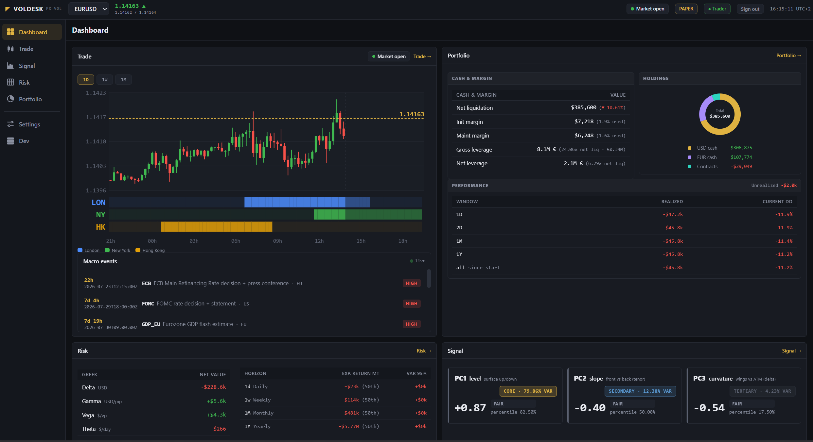

# FX Volatility Trading System

**End-to-end trading platform for EUR/USD FX options — a microservices pipeline
that turns a live Interactive Brokers feed into research-grade volatility signals,
executes delta-hedged option structures, and serves it all through a real-time web
desk.**

[](https://github.com/valerian-drmt/fx-volatility-trading-system/actions/workflows/ci.yml)


<p align="center">
  
</p>

A 7-view React trading desk on top of 5 async Python engines: live IB tick stream →
vol-surface fit (SVI / SSVI, GARCH, HAR-RV) → GMM regime + PCA signal z-scores →
delta-hedged order submission → versioned audit trail in Postgres.

## 🔴 Live demo

**[valeriandarmente.dev/fx-volatility-trading-system](https://valeriandarmente.dev/fx-volatility-trading-system/)** — the full stack running live on AWS (paper account).

The public site is **read-only**: browse live positions, the vol surface, PCA
signals, greeks and P&L. Trading, the config editor, and the developer console are
behind an auth boundary. Every push to `main` redeploys it automatically (see
[Deployment](#deployment)).

---

## Features

### Market data + execution
- IB Gateway container (gnzsnz fork) serving the EUR/USD FOP chains
- Real-time tick stream published on Redis (throttled ~200 ms)
- Structure factory: **straddle**, **strangle**, **risk reversal**, **butterfly**,
  **calendar** — built by delta pillar + tenor, delta-hedged via a 6E futures leg
- Marketable-limit pricing off the live touch; full order lifecycle (submit → fills
  → booked position) with idempotency and reconciliation against the IB mirror

### Volatility analytics
- **Regime detector** — GMM on `[vol_of_vol, vol_level, term_slope]` → 3 regimes
  (calm / stressed / pre-event) driving sizing multipliers
- **Surface fit** — SVI per tenor + SSVI global, butterfly + calendar no-arb checks,
  fair smile via EWMA on historical SVI params
- **Signal** — PCA(3) on the 30-D surface snapshot (6 tenors × 5 delta pillars),
  z-scoring each PC (level / slope / curvature) vs a rolling distribution
- **VRP** — realized forward vol vs ATM implied, conditional on regime

### Risk + P&L
- Greeks aggregation (Δ / Γ / V / Θ / vanna / volga) across open structures, per-tenor vega
- P&L attribution — Taylor decomposition (δ·dS + ½Γ·dS² + V·dσ + Θ·dt + residual)
- Delta hedge modes: static / threshold / scheduled; computed greek limits; VaR

### Admin & observability
- Versioned vol config in Postgres (append-only), edited in the web desk and
  hot-reloaded into the engines via Redis pub/sub
- Secrets in AWS SSM Parameter Store (KMS-encrypted) — never on disk, never echoed
- Structured JSON logs (structlog), Prometheus metrics, OpenTelemetry traces, and an
  opt-in Grafana / Loki / Tempo observability stack

---

## Architecture

**11-container core stack** (6 ship our Python code) **+ an optional 7-container
observability stack** (Prometheus / cAdvisor / Loki / Tempo / Grafana / promtail /
otel-collector, opt-in via `--profile obs`).

```
                          ┌────────────────┐
                          │  React cockpit │   ←──── Users
                          │   (frontend)   │
                          └────────┬───────┘
                                   │ HTTP + WS
                          ┌────────▼───────┐
                          │     nginx      │  reverse proxy (80/443)
                          └────────┬───────┘
                                   │
                          ┌────────▼───────┐
                          │    FastAPI     │  REST + WS bridge (8000)
                          │     (api)      │
                          └─┬────────────┬─┘
                            │            │
            ┌───────────────┘            └──────────────────┐
            ▼                                               ▼
    ┌─────────────┐                                ┌────────────────┐
    │  Postgres   │◄───── db-writer ─────┐         │     Redis      │
    │   (16)      │  (Redis → DB sink)   │         │ pub/sub + cache│
    └─────────────┘                      │         └─┬────┬──┬───┬──┘
                                         └───────────┤    │  │   │
       ┌────────────┐  ticks/bars     ┌──────────────▼┐   │  │   │
       │ ib-gateway │◄────────────────│ market-data    │───┘  │   │
       │  (IB API)  │  (clientID 1)   │   engine       │      │   │
       └─────┬──────┘                 └────────────────┘      │   │
             │     option chains       ┌────────────────┐     │   │
             ├─────(clientID 2)───────►│   vol-engine   │─────┘   │
             │                         │ SVI/SSVI/GARCH │         │
             │                         │ HAR/PCA/GMM    │         │
             │                         └────────────────┘         │
             │     positions+greeks    ┌────────────────┐         │
             ├─────(clientID 3)───────►│   risk-engine  │─────────┘
             │                         │ Δ/Γ/V aggreg.  │
             │                         └────────────────┘
             │     order submission    ┌────────────────┐
             └─────(clientID 5)───────►│ execution-eng. │  HTTP (:8001)
                                       │ orders+hedger  │
                                       └────────────────┘
```

| Container | Runs | Source |
|---|---|---|
| `postgres` | DB 16 | — |
| `redis` | Bus + cache | — |
| `nginx` | Reverse proxy | `infrastructure/nginx/` |
| `ib-gateway` | IB API | — (`gnzsnz/ib-gateway`) |
| `frontend` | React SPA | `frontend/` |
| **`api`** | FastAPI REST + WS | `src/api/` + shared libs |
| **`market-data`** | IB ticks → Redis (clientID 1) | `src/engines/market_data/` |
| **`vol-engine`** | SVI/SSVI/GARCH/HAR/PCA/GMM (clientID 2) | `src/engines/vol/` |
| **`risk-engine`** | Greeks + delta hedge (clientID 3) | `src/engines/risk/` |
| **`db-writer`** | Redis → Postgres async sink | `src/engines/db_writer/` |
| **`execution-engine`** | Order submission (clientID 5, :8001) | `src/engines/execution/` |

Networks: `fxvol-public` (nginx), `fxvol-internal` (services), `fxvol-external` (IB
outbound). The 5 Python engines live behind the `engines` compose profile.

Shared Python libs under `src/` (no container of their own):
- **`core/`** — pure pricing + vol + risk algorithms (no I/O)
- **`persistence/`** — SQLAlchemy 2 ORM (27 classes) + Alembic revisions + `AsyncDatabaseWriter`
- **`bus/`** — Redis pub/sub helpers + channel/key constants
- **`shared/`** — config, structlog, IB connection wrapper, observability

Dependency direction is enforced by [`import-linter`](.importlinter) in CI (5 layered
contracts: `core` pure, `bus`/`persistence` as adapters, `engines` never import `api`).
Full diagrams live in [`docs/architecture/`](docs/architecture/).

---

## Tech stack

| Layer | Tech |
|---|---|
| Language | Python 3.11 + TypeScript 5 |
| Packaging | `pyproject.toml` (PEP 621) — single source of truth; `uv` recommended |
| API | FastAPI + uvicorn + pydantic v2 + slowapi |
| Frontend | React 18 + Vite + TypeScript strict + zustand + plotly.js |
| Persistence | PostgreSQL 16 + SQLAlchemy 2 async + Alembic |
| Cache + bus | Redis 7 (pub/sub + cache) |
| IB connectivity | ib_insync (async) |
| Vol models | numpy, scipy, arch (GARCH), scikit-learn (GMM), custom SVI/SSVI |
| Secrets | AWS SSM Parameter Store + KMS |
| CI / CD | GitHub Actions — ruff, pytest, import-linter, OpenAPI drift, vitest, Playwright; OIDC deploy to AWS EC2 |

---

## Quickstart

**Prerequisites**: Docker Desktop + Python 3.11 + Node 20.

```powershell
# 1. venv + deps (one-off)
python -m venv .venv
.\.venv\Scripts\Activate.ps1
python -m pip install -e ".[dev,api,quant,ib,writer]"      # or: uv sync --extra dev --extra api --extra quant --extra ib --extra writer

# 2. Load secrets from SSM into the shell (dot-sourced — every PS session)
. .\scripts\local\load_secrets.ps1

# 3. Start the full stack (build + up + alembic upgrade head)
.\scripts\local\stack.ps1
.\scripts\local\stack.ps1 -NoBuild     # reuse cached images
```

Then:
- Cockpit — http://localhost/
- API health — http://localhost/api/v1/health
- Extended health (DB + Redis + engines) — http://localhost/api/v1/health/extended

PyCharm run configurations ship under [`.idea/runConfigurations/`](.idea/runConfigurations)
(version-controlled, grouped **Local** and **EC2**) — no setup needed.

---

## Deployment

Prod runs on a single AWS EC2 box, deployed **continuously from `main`** with no SSH
and no stored AWS keys:

```
push to main → GitHub Actions "build-and-push" (7 images → GHCR, tagged sha-<commit>)
             → "deploy-prod": OIDC into AWS → S3 config payload → SSM RunShellScript
             → the host pulls the images, renders .env from SSM, migrates, restarts
             → smoke-checks the live /health endpoint
```

The VM never builds — it only pulls. Secrets are read on the host from SSM via its
instance role; they never touch GitHub. Deploys are gated by a `DEPLOY_ENABLED` repo
variable, and `.idea`/`scripts`/`docs`-only pushes are `paths-ignore`d so they don't
redeploy. See [`docs/ops/deployment.md`](docs/ops/deployment.md).

---

## Testing

```powershell
python -m ruff check src tests                       # lint
PYTHONPATH=src python -m pytest                       # ~730 unit tests, < 15s
PYTHONPATH=src lint-imports                           # architecture contracts

# Integration suites (gated by env)
$env:DB_RUN_INTEGRATION = "1";    python -m pytest -m db_integration
$env:REDIS_RUN_INTEGRATION = "1"; python -m pytest -m redis_integration
$env:IB_RUN_INTEGRATION = "1";    python -m pytest -m integration

# Frontend
cd frontend
npm run lint && npm run typecheck && npm test         # ESLint + tsc + vitest
npm run test:e2e                                       # Playwright
```

Test layout mirrors `src/` 1-to-1 — see [`tests/STRUCTURE.md`](tests/STRUCTURE.md).

---

## Project structure

```
fx-volatility-trading-system/
├── pyproject.toml                 single source of truth (deps + ruff + pytest + mypy)
├── .importlinter                  architecture contracts (5 layered rules)
├── docker-compose.yml
├── .github/workflows/             ci · build · deploy · codeql · security-scan
├── src/                           (PyPA src-layout, all Python)
│   ├── api/                       → api container: main, 16 routers, ws, middleware, schemas, orchestration/events
│   ├── engines/                   5 long-running services (market_data, vol, risk, db_writer, execution)
│   ├── core/                      pure algos — vol (svi/ssvi/garch/har_rv/pca/gmm/…), pricing/bs, risk/greeks
│   ├── persistence/               DB adapter — models (27 ORM classes), db, writer, migrations/
│   ├── bus/                       Redis adapter — client, publisher, channels, keys
│   └── shared/                    config, logging, ib_connection, observability
├── frontend/                      React + TS + Vite — 7 voldesk views + a dev console (/dev)
├── infrastructure/
│   ├── docker/                    api / web / execution Dockerfiles
│   ├── nginx/                     nginx confs (dev + prod TLS)
│   ├── postgres/ redis/           init.sql + hardened redis.conf
│   ├── ec2/                       host bootstrap + remote-deploy
│   └── aws/                       OIDC / IAM / SSM setup
├── scripts/
│   ├── local/                     stack.ps1 + load_secrets.ps1 (user-run)
│   └── aws/                        ec2.ps1 + load_secrets.sh
├── obs/                           Prometheus / Loki / Tempo / OTel + Grafana dashboards
├── tests/                         unit/ + integration/ (mirrors src/) + fixtures/
└── docs/                          architecture · vol-modeling · strategy · execution · ops (+ diagrams/)
```

---

## Documentation

Full docs live in [`docs/`](docs/):

| Section | Covers |
|---|---|
| [architecture/](docs/architecture/) | System overview, backend layout, data flow, frontend, database schema |
| [vol-modeling/](docs/vol-modeling/) | PCA signals, SVI/SSVI surface, GARCH/HAR-RV forecasting, GMM regime (+ the runnable [PCA notebook](docs/vol-modeling/notebooks/pca_signal_pipeline_explained.ipynb)) |
| [strategy/](docs/strategy/) | Vol structures, signal→trade mapping, risk & P&L attribution |
| [execution/](docs/execution/) | OMS, order lifecycle, IB integration |
| [observability/](docs/observability/) | Metric conventions + operator runbooks |
| [ops/](docs/ops/) | Local stack, AWS deployment, secrets |

The `/dev` console (live on the site) also renders the container graph + health, the
DB schema, and the migration chain directly from the running system.

---

## Contributing

The GitHub project protocol (issue → PR → squash-merge, Conventional Commits, CI
gates) is under [`.github/`](.github/) — see
[`CONTRIBUTING.md`](.github/CONTRIBUTING.md) and [`WORKFLOW.md`](.github/WORKFLOW.md).

Reproduce CI locally:

```powershell
python -m compileall -q src
python -m ruff check src tests
PYTHONPATH=src lint-imports
PYTHONPATH=src python -m pytest
cd frontend; npm run typecheck && npm run lint && npm test && npm run build
```

---

## License

[MIT](LICENSE)
