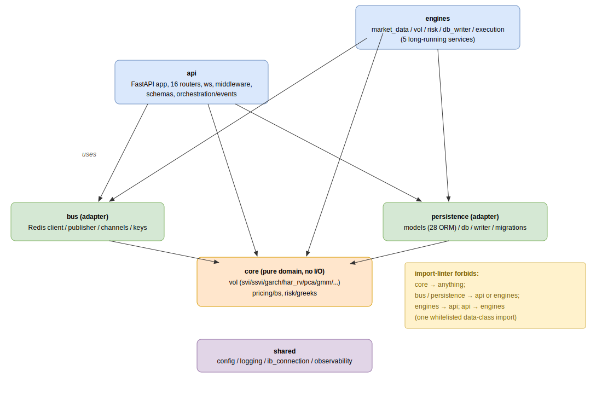

# Backend layout

All Python lives under `src/` (PyPA src-layout); imports resolve against
`PYTHONPATH=src` (e.g. `from api.main import app`, `from core.vol.svi import
calibrate_svi`). `pyproject.toml` is the single source of truth for dependencies,
ruff, pytest, and mypy config. The six top-level packages split into two
**presentation** layers, two **adapters**, one **pure domain** layer, and a
**cross-cutting** layer.

## Packages

| Package | Role | Highlights |
|---|---|---|
| `api/` | FastAPI app (presentation) | `main.py` (app + lifespan: events scheduler, WS bridge), 16 routers, `ws/` (connection manager + Redis→WS bridge), `middleware/`, `schemas/` (Pydantic v2), `orchestration/` (use cases + `events/` pipeline) |
| `engines/` | 5 long-running services (presentation) | `market_data/`, `vol/`, `risk/`, `db_writer/`, `execution/` — each an `engine.py` + `main.py` loop |
| `core/` | Pure domain, no I/O | `vol/` (svi, ssvi, garch, har_rv, pca_engine, gmm_regime, regime_engine, vrp, yang_zhang, …), `pricing/bs.py`, `risk/greeks.py` |
| `persistence/` | DB adapter | `models.py` (27 ORM classes), `db.py` (async engine + session), `writer.py` (`AsyncDatabaseWriter`), `migrations/versions/` (Alembic) |
| `bus/` | Redis adapter | `client.py` (async + sync factory), `publisher.py`, `channels.py`, `keys.py` |
| `shared/` | Cross-cutting infra | `config.py` (base `Settings` — env-var schema), `logging.py` (structlog), `ib_connection.py` (IB wrapper + backoff), observability helpers |

The `api` container image bundles `api` + `core` + `persistence` + `bus`; each
engine bundles its own `engines/<name>` plus the libs it needs. `core`, `bus`,
`persistence`, and `shared` have no container of their own.

## Import contracts

Dependency direction is enforced by [`import-linter`](../../.importlinter) in CI
(`lint-imports`). Five contracts:

| # | Contract | Rule |
|---|---|---|
| 1 | **core is pure** | `core` may not import `api`, `engines`, `bus`, or `persistence` — it is the only layer with no project imports (also: side-effect free, deterministic, explicitly typed by convention). |
| 2 | **bus is an adapter** | `bus` may not import `api` or `engines`. |
| 3 | **persistence is an adapter** | `persistence` may not import `api` or `engines`. |
| 4 | **engines do not depend on api** | `engines` publish to Redis and read the DB; they never call the FastAPI app. |
| 5 | **api does not depend on engine internals** | `api` may *route* to the execution-engine over HTTP but must not Python-import engine internals. One whitelisted exception: `api.routers.cockpit → engines.execution.structures` (pure data classes describing option structures). |

The result is a strict layering: presentation (`api`, `engines`) depends on adapters
(`bus`, `persistence`) and on `core`; adapters depend only on `core`; `core` depends
on nothing in the project. This rules out service-back-into-api loops and keeps the
numerical domain code testable in isolation.

## Related

- [overview.md](overview.md) — how these packages map to containers.
- [data-flow.md](data-flow.md) — how the packages exchange data at runtime.
- [database.md](database.md) — the `persistence` ORM models in detail.
