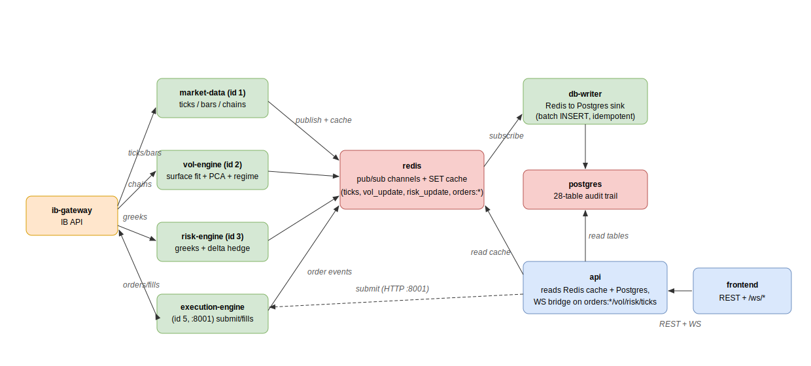

# Data flow

Data moves in one direction at runtime: **Interactive Brokers → engines → Redis →
db-writer → Postgres**, with the API reading from both Redis (live cache) and
Postgres (history) and pushing to the frontend over REST + WebSockets. No engine
calls the API; the API forwards order actions to the execution-engine over HTTP.

## The four IB client IDs

Each engine that touches IB Gateway opens its own `ib_insync` session with a distinct
client ID (a single userid allows one session per client ID):

| Engine | clientID | Consumes from IB | Produces |
|---|---|---|---|
| `market-data` | 1 | ticks, bars | spot/bid/ask + bars → Redis |
| `vol-engine` | 2 | EUR/USD FOP option chains | fitted surface, PCA signals, regime → Redis + Postgres |
| `risk-engine` | 3 | positions, greeks | portfolio greeks + P&L → Redis + Postgres |
| `execution-engine` | 5 | order acks, fills | order/fill/position rows → Postgres, events → Redis |

(clientID 4 is reserved for a legacy path.)

## Redis: pub/sub + last-value cache

`bus/channels.py` and `bus/keys.py` define the contract. Engines both **publish** an
event on a channel and **`SET`** the latest value under a TTL'd key, so a subscriber
that missed a message can still read current state.

| Channel (`channels.py`) | Publisher | Cadence |
|---|---|---|
| `ticks` | market-data | ~200 ms throttle |
| `account` | market-data | ~10 s |
| `vol_update` | vol-engine | end of each scan (~3 min) |
| `risk_update` | risk-engine | end of each cycle (~60 s) |
| `orders:<structure_id>` | execution-engine | per order event |
| `positions`, `exit_alerts` | position monitor | per cycle |
| `config:changed` | admin endpoint | on config PUT/revert |

Cache keys (`keys.py`) carry a prescribed TTL: `latest_spot:{symbol}` (30 s),
`latest_vol_surface:{symbol}` (600 s), `latest_greeks:portfolio` (30 s),
`heartbeat:{engine_name}` (300 s), etc. Every engine writes its own
`heartbeat:<name>` — the compose healthchecks compute `now - parse(ts)` against it.

## db-writer: the Redis → Postgres sink

`db-writer` subscribes to the streamed payloads and batches them into Postgres via
`persistence.writer.AsyncDatabaseWriter` (batch INSERT + retry + idempotency). The
vol, risk, and execution engines additionally write their own domain tables directly.

## API: reads cache + DB, bridges WS

The FastAPI app reads live state from the Redis cache and history from Postgres. Its
`ws/redis_bridge` subscribes to Redis (including the `orders:*` pattern) and forwards
to the `ConnectionManager`, exposing `/ws/ticks`, `/ws/vol`, and `/ws/risk`. Order
submission is *not* done in-process: the API forwards to `EXECUTION_URL`
(`http://execution-engine:8001`).

## Frontend

The React desk consumes REST (typed against the OpenAPI schema) plus the three
WebSocket streams. In voldesk the vol/risk WS beats are used only as
REST-invalidation triggers — each open tab re-fetches its snapshot family at a
bounded cadence rather than rendering raw WS payloads (see
[frontend.md](frontend.md)). There is no mock fallback; empty backend state renders
zeros plus a freshness badge.

## Related

- [backend.md](backend.md) — the packages behind each box.
- [database.md](database.md) — where the sinked payloads land.
- [frontend.md](frontend.md) — the consuming views and hooks.
