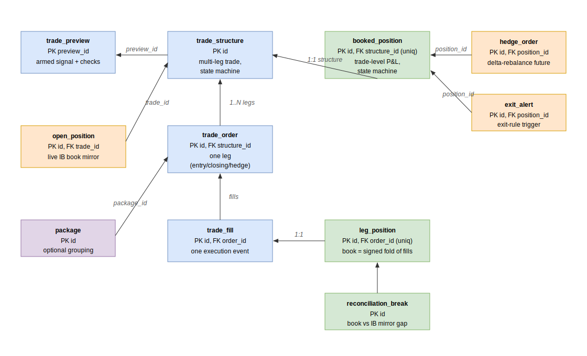

# Database

Persistence is PostgreSQL 16, accessed through SQLAlchemy 2 async. Every table maps
to an ORM class in [`src/persistence/models.py`](../../src/persistence/models.py) on a
single declarative `Base`, so Alembic can diff them together. The classes group into
four domains: **Trading**, **Vol & analytics**, **Regime & PCA**, and **Config**.



## Trading

The order-to-position pipeline and the book. A `trade_structure` is one multi-leg
trade; each `trade_order` is a leg; `trade_fill` is one execution event.
`leg_position` is the authoritative book (a signed fold of a leg's fills), while
`open_position` is demoted to a reconciliation mirror of the netted IB book.

| Class | Table | Role |
|---|---|---|
| `TradePreviewRow` | `trade_preview` | armed-trade audit row (checks, expiry, state) |
| `TradeStructure` | `trade_structure` | multi-leg trade + state machine |
| `StructureOrder` | `trade_order` | one leg (entry / closing / unwind / hedge) |
| `StructureFill` | `trade_fill` | one execution event on a leg |
| `LegPosition` | `leg_position` | forward per-leg book (`open_qty`, `reserved_qty`) |
| `ReconciliationBreak` | `reconciliation_break` | materialised book vs IB-mirror gap |
| `BookedPosition` | `booked_position` | trade-level entity: entry cost, state, P&L |
| `BookedPositionMetricHistory` | `booked_position_metric_history` | per-cycle MTM + signal tracking |
| `OpenPosition` | `open_position` | live IB book mirror (one row per contract) |
| `OpenPositionHistory` | `open_position_history` | per-cycle greeks/pnl/iv per leg |
| `HedgeOrder` | `hedge_order` | delta-rebalancing future order |
| `ExitAlert` | `exit_alert` | one exit-rule trigger |
| `Package` | `package` | optional grouping of several trades |
| `TradeEvent` | `trade_event` | unified append-only event journal |
| `AccountHistory` | `account_history` | IB account snapshot (NetLiq, margin, cushion) |
| `IbConnectionState` | `runtime_ib_session` | singleton broker connectivity row |
| `BookStateSnapshot` | `book_state_snapshot_history` | aggregated book greeks + exposure |

## Vol & analytics

| Class | Table | Role |
|---|---|---|
| `VolSurface` | `vol_surface_history` | fitted surface snapshot (JSONB `surface_data`) |
| `FeatureHistory` | `feature_history` | wide-format feature timeseries (ATM IVs, RV, slope, z-scores) |
| `Event` | `event_calendar` | economic calendar (dedup by `event_hash`) |

## Regime & PCA

| Class | Table | Role |
|---|---|---|
| `RegimeSnapshot` | `regime_snapshot_history` | per-cycle regime label + probabilities |
| `SurfaceSnapshotHourly` | `pca_surface_snapshot_history` | 30-dim snapshot (6 tenors × 5 deltas) for the PCA fit |
| `PcaModel` | `pca_model` | versioned PCA (means/stds/loadings/eigenvalues as JSONB) |
| `PcaSignal` | `pca_signal_history` | one row per PC per cycle (raw/z score, label, actionable) |

`SurfaceSnapshotHourly` declares its 30 IV columns (`iv_{tenor}_{delta}`) dynamically
from the `_TENORS × _DELTAS` grid.

## Config

| Class | Table | Role |
|---|---|---|
| `VolConfig` | `config_vol_engine` | append-only versioned vol config |
| `AppConfigScalar` | `config_scalar` | scalar params by `namespace` (`risk`, `delta_hedge`) |
| `ExitRulesConfig` | `config_exit_rules` | hot-reloadable exit-rule params |

## VolConfig versioning

`VolConfig` is **append-only and versioned**. Its primary key is `version` (an int);
every `PUT /api/v1/admin/config` inserts a new row with the next version, and the
latest row is the source of truth. Older rows provide the audit trail, revert, and
backtest reproducibility (a backtest can pin `config_version=N` to replay that
config). The config body is stored as JSONB, so adding a Pydantic field needs no
migration. On write, the admin endpoint publishes the new version number on the
`config:changed` Redis channel and the engines hot-reload without a restart.

## Migrations

Schema changes are Alembic revisions under `src/persistence/migrations/versions/`
(50+ revisions). Apply the chain with:

```bash
docker compose exec api alembic -c src/persistence/alembic.ini upgrade head
docker compose exec api alembic -c src/persistence/alembic.ini revision --autogenerate -m "<msg>"
```

Table renames and column folds are threaded through the revisions (the docstrings in
`models.py` cite the migration that introduced each change — e.g. `open_position`
was renamed from `position` in migration 033, and the scalar config tables were
unified in migration 037). The `/dev` console renders both the ORM-vs-DB drift and
the live migration chain.

## Related

- [backend.md](backend.md) — the `persistence` adapter and its contracts.
- [data-flow.md](data-flow.md) — how rows get written by db-writer and the engines.
