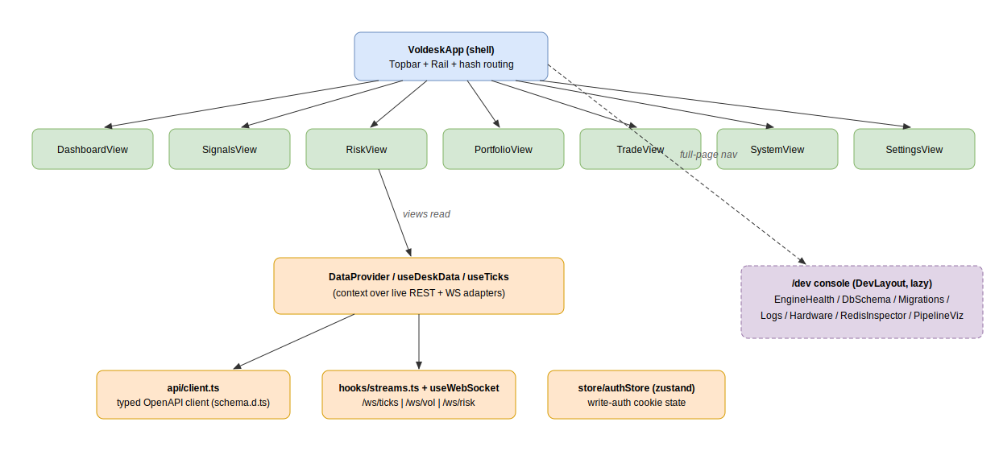

# Frontend

The frontend is **voldesk** — a React 18 + Vite + strict-TypeScript trading desk,
with state in zustand, a typed OpenAPI client, and Plotly for charts. It is served
at the deploy subpath (`vite base` = `import.meta.env.BASE_URL`); nginx proxies the
API and WebSockets from the same origin.



## Shell and routing

`src/main.tsx` does path-based, base-aware routing:

- `/` → `voldesk/VoldeskApp.tsx` — the desk shell (Topbar + left Rail + hash routing).
- `/dev/*` → `pages/DevLayout.tsx` — the operator console, lazy-loaded.

Inside the desk, views route by hash (`#trade`, `#risk`, …) for cheap navigation; the
Rail's **Dev** item does a full-page nav to `${BASE_URL}dev`.

## The 7 views

Each rail tab is one component under `voldesk/views/`:

| View | Purpose |
|---|---|
| `DashboardView` | Top-level desk summary: spot, account, greeks, regime at a glance. |
| `SignalsView` | PCA signal panel — PC z-scores, labels, regime context. |
| `RiskView` | Portfolio greeks (Δ/Γ/V/Θ), per-tenor vega, P&L. |
| `PortfolioView` | Open positions, structures, cash holdings, P&L breakdown. |
| `TradeView` | Multi-leg order builder and submit (write-gated). |
| `SystemView` | Engine health / connectivity surfaced from the backend. |
| `SettingsView` | The versioned vol config editor (write-gated). |

## Data wiring

All views read live data through `useDeskData()` / `useTicks()`
(`voldesk/data/deskData.ts`), a context over the live REST/WS adapters in
`voldesk/data/live/`. `DataProvider` holds the desk slices; `TicksProvider` supplies
a 1 Hz spot. There is **no mock fallback**: when the backend has no data, views
render zeros/empty rows plus a per-panel `FreshBadge` — never fabricated numbers.

### Typed OpenAPI client

`src/api/client.ts` + `endpoints.ts` sit on top of `src/api/schema.d.ts`, generated
from the backend's OpenAPI document. CI runs `npm run gen:api:check` to fail on drift
between the schema and the server.

### WebSocket hooks

`src/hooks/streams.ts` wraps `useWebSocket` into typed, staleness-aware streams:

```ts
export const useTicks   = (enabled = true) => useStream<TickMsg>("/ws/ticks", 10_000, 1000);
export const useVolStream  = (enabled = true) => useStream<unknown>("/ws/vol",  240_000, 30_000);
export const useRiskStream = (enabled = true) => useStream<unknown>("/ws/risk",  90_000, 15_000);
```

Ticks are coalesced to a steady 1 s beat for display; the vol/risk beats are used
only as REST-invalidation triggers (throttled 30 s / 15 s) so each open tab
re-fetches its snapshot family at a bounded cadence instead of on every engine cycle.

### Stores

zustand holds cross-cutting UI state — `src/store/authStore.ts` tracks the write-auth
cookie state that gates the Trade submit, the Settings editor, and `/dev`.

## The /dev console

`pages/dev/` is an operator console rendered directly from the running system:
`EngineHealth`, `DbSchema` (ORM-vs-DB drift), `Migrations` (the Alembic chain),
`Logs`, `Hardware` (per-container CPU/RAM), `RedisInspector`, `PipelineViz`,
`StackOverview`, and more. It is behind the write-auth boundary.

## Related

- [data-flow.md](data-flow.md) — the REST + WS streams the views consume.
- [overview.md](overview.md) — how `frontend` and `nginx` fit the container stack.
