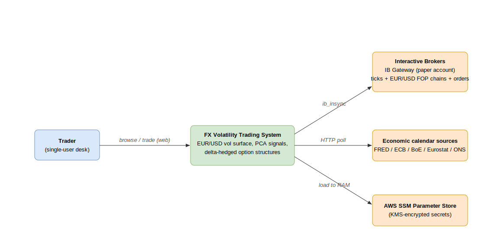
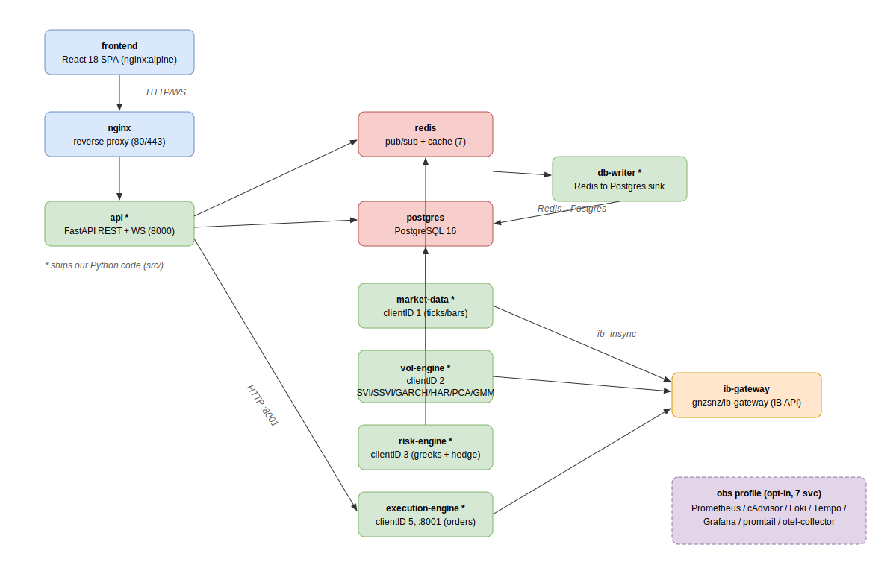

# Architecture overview

The FX Volatility Trading System trades **EUR/USD FX options**. It turns a live
Interactive Brokers feed into a fitted volatility surface, a market regime, and
PCA-based richness signals, then executes delta-hedged option structures and books
every fill into a versioned Postgres audit trail. A React desk (voldesk) renders the
whole pipeline in real time.

The platform is a **microservices stack** — one FastAPI process, five long-running
Python engines, and the infrastructure they depend on — orchestrated by
`docker-compose.yml` across three networks.

## System context

The desk is single-user. It talks to Interactive Brokers over `ib_insync` (ticks,
EUR/USD FOP chains, orders), polls public economic-calendar sources (FRED / ECB /
BoE / Eurostat / ONS) for the event pipeline, and reads its secrets from AWS SSM
Parameter Store at boot.

## The container stack

The **core stack is 11 containers**; **six ship our own Python code** (marked `*`).
An optional **7-container observability stack** starts under `--profile obs`.

| Container | Runs | Source |
|---|---|---|
| `postgres` | PostgreSQL 16 | — |
| `redis` | pub/sub + cache (7) | — |
| `nginx` | reverse proxy (80/443) | `infrastructure/nginx/` |
| `ib-gateway` | IB API | `ghcr.io/gnzsnz/ib-gateway` |
| `frontend` | React SPA (nginx:alpine) | `frontend/` |
| `api` * | FastAPI REST + WS (8000) | `src/api/` + `src/core/` + `src/persistence/` + `src/bus/` |
| `market-data` * | IB ticks/bars → Redis (clientID 1) | `src/engines/market_data/` |
| `vol-engine` * | SVI/SSVI/GARCH/HAR/PCA/GMM (clientID 2) | `src/engines/vol/` |
| `risk-engine` * | greeks + delta hedge (clientID 3) | `src/engines/risk/` |
| `db-writer` * | Redis → Postgres async sink | `src/engines/db_writer/` |
| `execution-engine` * | order submission (clientID 5, :8001) | `src/engines/execution/` |

The five engines live behind the `engines` compose profile; a plain `docker compose
up` brings up the API demo without a live IB connection. `ib-gateway` is opt-in via
`--profile ib`.

### Networks

Three bridge networks isolate traffic (see [`docker-compose.yml`](../../docker-compose.yml)):

- **`fxvol-public`** — only `nginx` is exposed to the internet.
- **`fxvol-internal`** — every service; the subnet `172.20.0.0/24` is pinned so the
  engines get stable IPs (`.10`–`.14`) that IB Gateway can trust.
- **`fxvol-external`** — outbound-only lane for `ib-gateway` to reach IB servers.

### Observability (opt-in)

`--profile obs` adds Prometheus, cAdvisor, Loki, promtail, Tempo, otel-collector, and
Grafana. A narrower `metrics` profile (Prometheus + cAdvisor only) exists so prod can
serve the `/dev` Hardware graphs without the parts that must not run on a public host.

## Live deployment

Prod runs the core stack on a single AWS EC2 box, deployed continuously from `main`:
GitHub Actions builds the six images to GHCR, then an OIDC-authenticated
`deploy-prod` job hands a config payload to the host over SSM, which pulls the
images, renders its `.env` from SSM, migrates, and smoke-checks `/health`. The
public site is read-only; writes and `/dev` require the auth cookie. See
[ops/deployment.md](../ops/deployment.md).

## Where to go next

- [backend.md](backend.md) — the `src/` module layout and the import contracts.
- [data-flow.md](data-flow.md) — how one tick becomes a signal and an order.
- [frontend.md](frontend.md) — the voldesk views and live data wiring.
- [database.md](database.md) — the 28-table schema and migration flow.
