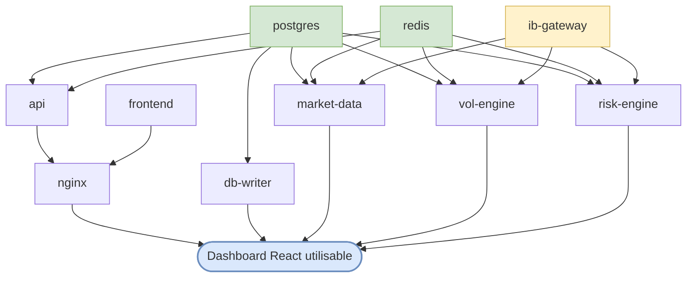

# Dépendances entre containers — ordre de test

> Pour chaque container : ce dont il a besoin pour tourner, ce dont on a besoin pour le tester en isolation, et l'ordre de validation recommandé.

---

## Graphe de dépendances



Lecture : une flèche `A → B` veut dire "B a besoin de A pour fonctionner". Le **Dashboard React utilisable** (en bas) dépend de **tout** ce qui est au-dessus.

---

## Par container : runtime deps + test deps

| Container | Runtime deps | Pour le tester en isolation | Approche test |
|---|---|---|---|
| `postgres` | aucun | aucun | Spin up seul, INSERT/SELECT/DELETE direct SQL via psycopg2. Aucun mock. |
| `redis` | aucun | aucun | Spin up seul, SET/GET/DEL + PUB/SUB via `redis` package. Aucun mock. |
| `ib-gateway` | aucun | compte IB paper actif | Spin up seul, `Test-NetConnection :4002` + check Xvfb logs. |
| `api` | postgres + redis healthy | postgres + redis up | Spin up postgres + redis + api, hit endpoints HTTP via `requests`. Cible interne uniquement (pas via nginx). |
| `db-writer` | postgres | postgres up | Postgres seul + injection events Python directement dans la queue asyncio du writer (notebook qui import le service en standalone). |
| `market-data` | postgres + redis + ib-gateway | postgres + redis + **ib-stub** | Stubber ib-gateway via `infrastructure/docker/Dockerfile.ib-stub` qui simule TWS API. Vérifier après un cycle que `latest_spot:EURUSD` est dans Redis et que `account_snaps` a une row dans Postgres. |
| `vol-engine` | postgres + redis + ib-gateway | idem | Idem. Vérifier que `vol_surfaces`, `signals`, `svi_params`, `ssvi_params` se remplissent après un scan. |
| `risk-engine` | postgres + redis + ib-gateway | idem + une position dans `positions` | Idem. Vérifier que `position_snapshots` se remplit toutes les 60s. |
| `nginx` | api + frontend up | api + frontend up | Spin up api + frontend + nginx, hit `localhost:80` pour valider routing `/api/`, `/ws/`, `/`. |
| `frontend` | aucun runtime, mais **toute la chaîne pour validation visuelle** | bundle build OK = test minimal ; UI complète = besoin de tout en marche | Test minimal isolé : check du bundle (`/index.html` + `/assets/*.js`). Test UX complet : nécessite postgres + redis + api + nginx + engines + ib-gateway + données seedées. |

---

## Cas particulier du frontend

Le frontend a deux niveaux de validation :

### Niveau 1 — bundle technique (isolation)

```
docker compose up frontend
curl http://localhost:8080/  →  HTML + référence /assets/*.js
```

Valide que la build React/Vite est correcte. **Ne valide PAS l'UX.**

### Niveau 2 — affichage des données (full stack)

Pour vérifier que **toutes les données s'affichent dans une bonne UI**, il faut la chaîne complète :

```
postgres + redis + api + nginx + frontend  ← nécessaire pour les fetches REST
                                          + engines (md/vol/risk)  ← pour remplir les caches Redis lus en WebSocket
                                          + ib-gateway (vrai ou stub)  ← pour alimenter les engines
                                          + données seedées (positions, vol_surfaces, signals)
```

Sans ça :
- Les panels affichent des `404 — Vol surface not found` (pas de data en Redis)
- Les WebSockets sont silencieux (rien n'est PUBlié)
- Les tableaux sont vides (`[]` retourné par `/api/v1/positions`, `/signals`, etc.)

C'est précisément pourquoi on ne valide pas le frontend en isolation : son rôle = consommer du flux temps réel + des reads PG. Sans ces deux sources alimentées, l'UI tourne mais affiche du vide partout.

**Recommandation pratique** : créer `scripts/frontend/01_test_e2e.ipynb` plus tard, qui :
1. Vérifie que la chaîne complète tourne (`docker compose ps` = tous healthy)
2. Seed les tables (positions OPEN + 1 vol_surface) via `02_setup` extension
3. Lance Playwright headless pour driver le browser, prendre des screenshots, vérifier visuellement que chaque panel a des données

Avant ça, valider chaque container source individuellement = stratégie bottom-up.

---

## Ordre de validation recommandé

Bottom-up, du plus indépendant au plus intégré :

| # | Container | Notebook | Statut |
|---|---|---|---|
| 1 | `postgres` | `scripts/smoke/postgresql/02_setup` + `03_test_crud` | ✅ |
| 2 | `api` | `scripts/smoke/api/01_test_endpoints` | ✅ |
| 3 | `nginx` | `scripts/smoke/nginx/01_test_routes` | ✅ |
| 4 | `redis` | `scripts/smoke/redis/01_test_pubsub` | ✅ (ce ticket) |
| 5 | `db-writer` | `scripts/smoke/db-writer/01_test_writer` (à venir) | ⏳ |
| 6 | `ib-gateway` (vrai) | `scripts/smoke/ib-gateway/01_test_gateway` (à venir, requiert compte IB) | ⏳ |
| 7 | `market-data` | `scripts/engines/01_test_market_data` (avec ib-stub) | ⏳ |
| 8 | `vol-engine` | `scripts/engines/02_test_vol_engine` (avec ib-stub) | ⏳ |
| 9 | `risk-engine` | `scripts/engines/03_test_risk_engine` (avec ib-stub) | ⏳ |
| 10 | `frontend` (bundle) | `scripts/frontend/01_test_bundle` (à venir) | ⏳ |
| 11 | `frontend` (e2e Playwright) | `scripts/frontend/02_test_e2e` (à venir, finale) | ⏳ |

Une fois les 11 cochés, n'importe quel container peut tomber et tu sais exactement où chercher la cause sans démarrer toute la stack.

---

## Stratégie pour les containers qui dépendent d'IB Gateway

Les 3 engines dépendent d'`ib-gateway`. Comme avoir un compte IB paper actif n'est pas toujours possible (et n'est pas reproductible dans un CI), on utilise un **stub** :

- `infrastructure/docker/Dockerfile.ib-stub` + `infrastructure/docker/ib-stub/server.py` — déjà présents dans le repo (R3+)
- Image légère qui écoute `:4002` et répond aux requêtes TWS API binaires avec des données canned (un set de ticks EURUSD réplay, une chain d'options figée).
- À activer via un nouveau profile compose `ib-stub` (équivalent au profile `ib` qui lance le vrai gateway). Mutually exclusive : tu lances `--profile ib` OU `--profile ib-stub`, jamais les deux.

Avantages :
- Tests engines reproductibles, pas d'auth IB requis
- CI peut tourner `--profile engines --profile ib-stub` headless
- Permet de simuler des cas pathologiques (déconnexion broker, ticks aberrants) que le vrai gateway ne reproduit pas facilement

Inconvénient :
- Le stub ne couvre pas les bugs liés à l'auth IB / IBC / Xvfb — qu'il faut tester séparément avec un compte paper réel quand on veut vraiment shipper.

---

## Liens

- Architecture : [`schémas/containers-overview.md`](./schémas/containers-overview.md) + [`.drawio`](./schémas/containers-overview.drawio)
- DB schema : [`schémas/postgres-architecture.md`](./schémas/postgres-architecture.md)
- API endpoints : [`API_ENDPOINTS.md`](./API_ENDPOINTS.md)
- Notebooks de test existants : `scripts/smoke/postgresql/`, `scripts/smoke/api/`, `scripts/smoke/nginx/`, `scripts/smoke/redis/`
