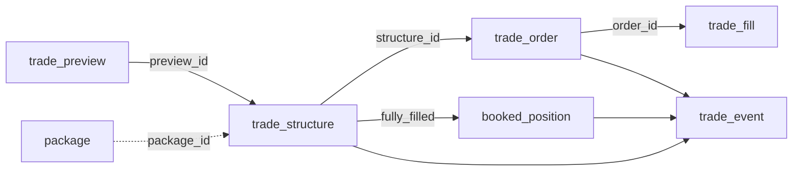

# Database schema — reference

The v2 schema is **24 ORM-mapped tables**, all declared in a single file
(`src/persistence/models.py`) so Alembic can diff them together. Alembic head
is **`044`** (chain `032 → 044` on top of the R9 baseline `031`). This doc is
the canonical map: what each table is for, who writes it, and how they relate.

> Names here are the **post-R10.1 schema** (most tables were renamed to a
> `<domain>_<role>` shape, e.g. `positions → open_position`,
> `vol_surface_snapshot → vol_surface_history`). Several lookup tables were
> folded into code constants — see [Dropped tables](#dropped-tables).

## Write paths

The v2 topology has a **single streaming writer** — the `db-writer` container,
which consumes the Redis `db_events` channel and bulk-inserts into Postgres.
Everything else is written transactionally, request-scoped, by the service that
owns the workflow.

| Path | Writer | Tables |
|---|---|---|
| **Streaming** (`db_events` → db-writer) | `db-writer` | `account_history`, `open_position`, `open_position_history`, `vol_surface_history` (the four in `writer.TABLE_MODELS`) |
| **Direct** (`AsyncSession`) | `execution-engine` | `trade_structure`, `trade_order`, `trade_fill`, `booked_position`, `trade_event`, `hedge_order`, `runtime_ib_session` (IB lifecycle + reconciliation + heartbeat) |
| **Direct** (`AsyncSession`) | `api` orchestration | `trade_preview`, `package`, `exit_alert`, `pca_model`, `book_state_snapshot_history`, `config_scalar`, `config_exit_rules`, `config_vol_engine` (edited via `/admin/config` + `/settings`) |

> **Known gap.** `vol-engine` also fans `regime_snapshot_history`,
> `pca_signal_history`, `pca_surface_snapshot_history` (and a `feature_history`
> table that has no ORM model on `main`) onto `db_events`, but those names are
> **not yet in `TABLE_MODELS`** — the writer logs and drops them. Adding the
> ORM mapping is a tracked follow-up; until then those analytics streams are
> served live from Redis, not replayed from Postgres.

---

## Portfolio & account

The live book as IB reports it, plus its time series for the equity curve.

| Table | Purpose | Key columns / cadence |
|---|---|---|
| `open_position` | Open book — one row per IB contract held, `DELETE`d when qty hits 0. Mirrors Portfolio panel E. | `id` (deterministic hash), `structure`, full greeks in USD, `product_label`; FK → `trade_structure`, `package`. Risk-engine UPDATEs greeks each cycle. |
| `open_position_history` | Time series of the above — risk-engine writes one row **per open position per cycle**. | FK → `open_position` (`CASCADE`), `timestamp` + same greek columns. |
| `account_history` | IB account-summary snapshots (net liq, margin, cushion, per-currency JSONB). | `timestamp`, margin/liquidity tags. |
| `book_state_snapshot_history` | Aggregated book state — `is_current=true` row per symbol + history. | totals (vega/gamma/theta/delta USD), `vega_by_tenor`/`vega_by_pc_source` JSONB. |

## Vol surface & regime

| Table | Purpose | Key columns / cadence |
|---|---|---|
| `vol_surface_history` | One row per vol-engine cycle — the full surface (incl. SVI/SSVI params) as JSONB. | `UNIQUE(timestamp, underlying)`, `spot`, `forward`, `surface_data` JSONB. Idempotent on retry. |
| `regime_snapshot_history` | Step 1 regime classification, one row per cycle. | `label ∈ {calm, stressed, pre_event}`, GMM probabilities, feature enrichment (bucket / Δz-1h / pct / signal per feature). |
| `event_calendar` | Scheduled macro events (FRED + ECB + BoE + FOMC + Eurostat + ONS, or manual), read by the regime gate. | `UNIQUE(event_hash)` for dedup, `impact ∈ {high, medium, low}`, `scheduled_at`, `source`. |

## PCA pipeline

| Table | Purpose | Key columns / cadence |
|---|---|---|
| `pca_surface_snapshot_history` | 30-dim hourly snapshot (6 tenors × 5 deltas) — the PCA fit input. | `UNIQUE(symbol, timestamp)`, 30 dynamically-declared `iv_<tenor>_<delta>` columns. |
| `pca_model` | Versioned PCA model — JSONB `means`/`stds`/`loadings`/`eigenvalues` (schema-less for dim flexibility). | `version` unique, `is_active`, `superseded_by`, cosine-similarity + sign-flip stability vs the prior fit. |
| `pca_signal_history` | One row **per PC per cycle** — feeds the Signals panel + history charts. | FK → `pca_model`, `UNIQUE(symbol, timestamp, pca_model_id, pc_id)`, `z_score`, `label ∈ {CHEAP, FAIR, EXPENSIVE}`, `actionable`, `recommended_structure`. |

## Trade lifecycle (Step 3 — preview → Step 4 — execution)

| Table | Purpose | Key columns / cadence |
|---|---|---|
| `trade_preview` | Audit log — one row per *Arm*. State machine `valid_for_submit → submitted / blocked / expired / cancelled`. | `preview_id` unique, FK → `pca_signal_history`, `structure_full_payload` JSONB, `pre_submit_checks`. |
| `package` | Operational grouping of several structures under one risk/funding envelope (Murex "package"). | `label`; empty until an operator bundles trades. |
| `trade_structure` | Multi-leg trade — one row per *Submit*. | FK → `trade_preview`, `package`, `pca_signal_history`; state machine to `closed`; entry-cost + close columns. |
| `trade_order` | One leg of a structure. | FK → `trade_structure`, `UNIQUE(structure_id, leg_idx, order_role)`, IB order/perm ids, full contract spec, fill aggregates. |
| `trade_fill` | One execution event on a leg. | FK → `trade_order`, `ib_execution_id` unique, fill price/qty, spot/bid/ask at fill. |
| `booked_position` | Position created when a structure is `fully_filled` — consumed by Step 5. | FK → `trade_structure` (unique), entry greeks, `state ∈ {open, closing, closed, expired}`, IB reconciliation columns. |
| `trade_event` | Unified append-only event journal (folded from `execution_audit_log`). | `event_type` discriminator, `severity` (5-level), nullable FKs → structure / order / position, `payload` JSONB. |

## Position monitoring (Step 5)

| Table | Purpose | Key columns / cadence |
|---|---|---|
| `booked_position_metric_history` | One row per monitoring cycle per open position — equity curve + P&L attribution + drawdown. | FK → `booked_position`, `UNIQUE(position_id, timestamp)`, P&L decomposition (vega/gamma/theta/other), signal-vs-entry trail (folded from `position_signal_tracking`). |
| `hedge_order` | Delta-rebalancing future order on an open position. | FK → `booked_position`, `delta_imbalance_at_trigger`, `state ∈ {pending, submitted, filled, failed}`. |
| `exit_alert` | One row per exit-rule trigger — acted on or not. | FK → `booked_position`, `trade_structure`; `action_recommended ∈ {EXIT, TRIM, ALERT_ONLY}`, `rule_detail` JSONB. |

## Runtime & config

| Table | Purpose | Key columns / cadence |
|---|---|---|
| `runtime_ib_session` | Singleton broker-connectivity row — `UPDATE` in place, never a new INSERT past the seed. | `account_type ∈ {paper, live}`, heartbeat + funds/buying-power from the execution-engine loop. |
| `config_scalar` | Unified scalar config — folds the former `delta_hedge_config` + `risk_limits` (migration 033). | `UNIQUE(namespace, name)`; `namespace ∈ {delta_hedge, risk}`; hot-reloadable. |
| `config_exit_rules` | Hot-reloadable exit-rule params. | `rule_name` unique, `params` JSONB, `priority 1..10`. |
| `config_vol_engine` | Append-only versioned config for the whole vol pipeline. | PK `version` (each PUT on `/api/v1/admin/config` inserts the next), `config` JSONB (schema-less → no migration for new Pydantic fields). |

---

## Dropped tables

Tables removed during R9/R10 and where their data now lives:

| Dropped table | Migration | Replacement |
|---|---|---|
| `svi_params`, `ssvi_params` | R9 (019) | folded into `vol_surface_history.surface_data` JSONB |
| `regime_pattern_dict` | 042 | code constant `core.regime_patterns.REGIME_PATTERNS` |
| `pca_structure_recommendation` | 042 | code constant `core.pca_recommendations` |
| `structure_definitions` | 043 | `in_catalog` entries of `core.trade_preview.TEMPLATES` |
| `execution_audit_log` | 038 | folded into `trade_event` |
| `position_signal_tracking` | 039 | folded into `booked_position_metric_history` (+8 columns) |
| `trades` | 044 | fills land in `trade_fill` via the execution engine |
| `orders`, `order_events` | 044 | IB order lifecycle in `trade_order`; audit in `trade_event` |
