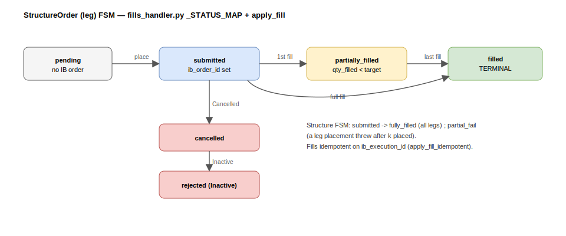

# Order lifecycle

This traces one structure from Submit, through IB placement and fills, to a
booked position. The live path is
[`engines/execution/live_submit.py`](../../src/engines/execution/live_submit.py)
and the fill callbacks in
[`fills_handler.py`](../../src/engines/execution/fills_handler.py).



## States

Each `structure_order` (one leg) moves through the FSM above; IB's raw
`orderStatus` is normalised by `_STATUS_MAP` in `fills_handler.py`:

| IB status | Leg state |
|---|---|
| `Submitted` / `PreSubmitted` / `PendingSubmit` / `ApiPending` | `submitted` |
| `Filled` | `filled` (terminal) |
| `Cancelled` / `ApiCancelled` | `cancelled` (terminal) |
| `Inactive` | `rejected` (terminal) |

Leg states: `pending → submitted → partially_filled → filled`, plus terminal
`cancelled` / `rejected`. Structure states: `submitted → fully_filled` (all legs
filled), or `partial_fail` when a leg placement throws after some legs are already
live.

## Submit → IB

`submit_structure_live` runs in two phases so a failure never leaves half a
structure in an unknown state:

1. **Phase 1 (no side effects)** — validate + `qualifyContractsAsync` **every**
   leg before placing any. Qualification failure (the dominant real failure) is a
   zero-orders-placed abort; the claim is released so a retry is possible.
   A `FUT` on `CME` retries once with the legacy `GLOBEX` alias.
2. **Phase 2 (place + commit per leg)** — `placeOrder`, stamp `ib_order_id` /
   `ib_perm_id`, set state `submitted`, then `commit` per leg so the DB never lags
   IB. A failure at leg *k* leaves legs 1..k-1 live and committed; the structure
   goes `partial_fail`.

An optional **combo (BAG)** path places combo-eligible option legs as one IB order
so they fill all-or-nothing (no naked half-fill), gated by `EXECUTION_USE_COMBO`.

## Idempotency

Two layers keep a replay from double-placing:

- **Submit claim (EXEC-1)** — an atomic `UPDATE ... WHERE submit_claimed_at IS
  NULL`, committed *before* anything touches IB. A replay loses the race and raises
  `LiveSubmitAlreadyClaimed` (HTTP 409). Only legs with `state='pending'` and
  `ib_order_id IS NULL` are eligible.
- **`orderRef`** — every IB order carries `fxvol:{structure_id}:{order_id}`
  (`order_ref()`). IB persists it across restarts, so an orphan stays discoverable
  and the reaper adopts it back onto its DB row.

Fills are idempotent on `ib_execution_id`
([`core/execution/fills.py`](../../src/core/execution/fills.py)):

```python
apply_fill_idempotent(seen_execution_ids, new_id) -> bool   # False = already persisted
```

The same execution id can be re-delivered on reconnect; the O(1) test drops it.

## Partial fills

On each `execDetailsEvent`, `fills_handler` persists the new `StructureFill`, then
recomputes the order aggregates from the **full** fill stream via
`update_order_aggregates`:

```
qty_filled = Σ fill.qty
avg_fill_price = Σ(qty·price) / Σ qty          # vwap
slippage_per_contract = signed vs preview_price, side-aware
fully_filled = qty_filled ≥ target_qty
```

`fully_filled` → state `filled`; otherwise `partially_filled`. Each fill rebuilds
the leg projection (`rebuild_leg`), and a closing fill releases the entry leg's
reservation. When all legs fill, `maybe_complete_structure` promotes the structure
to `fully_filled` and books the position (`state="open"`).

When the netted IB mirror can't confirm a fill (two trades holding opposite sides
net to zero at IB), `state_from_recorded_fills` repairs a stuck order from its
**own** recorded fills — book-only, it never fabricates a fill from the mirror.

## Marketable-limit pricing

The stored preview premium is theoretical and mis-prices real options (esp. OTM),
so a limit at it never crosses. `_marketable_limit` re-prices each leg off IB's
**live quote** at submit time; the pure core is `marketable_from_quote`:

```python
# BUY → ask, SELL → bid, snapped to the 0.0001 CME tick
BUY :  ceil(ref / tick) * tick        ref = ask or mkt
SELL:  floor(ref / tick) * tick       ref = bid or mkt
```

The theoretical `fallback` is used *only* when the relevant quote side is absent —
and a fallback BUY sits below the ask / SELL above the bid, so it does not cross:
that non-marketable rest is exactly why a leg with no live quote hangs `submitted`.
`_live_quote` warms a cold market-data line with a few retries first (the common
case for the 2nd+ leg of a strangle/spread) so it prices at the touch and fills.
