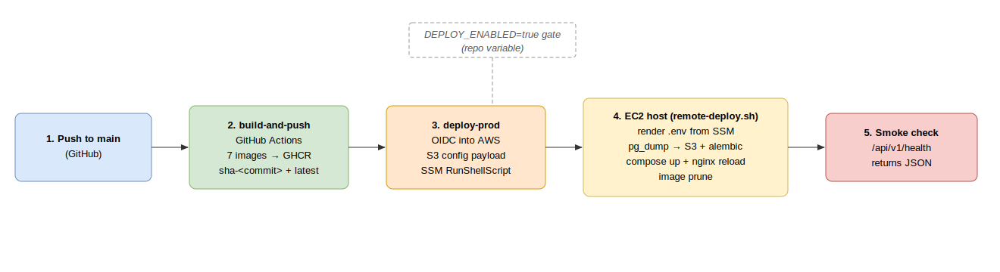

# Deployment

Continuous deploy of the production stack to a single AWS EC2 host. The local
stack is in [local-stack.md](local-stack.md); secrets in [secrets.md](secrets.md).



## Pipeline

A push to `main` runs [`build.yml`](../../.github/workflows/build.yml)
(`build-and-push`); on success [`deploy.yml`](../../.github/workflows/deploy.yml)
(`deploy-prod`) chains off it via `workflow_run`. No SSH, no inbound port 22 —
the runner federates into AWS through GitHub OIDC and drives the host over SSM.

### 1. build-and-push → GHCR

`build-and-push` builds seven images and pushes each with two tags —
`sha-<commit>` (reproducible) and `latest` — to `ghcr.io/<owner>/`:

`fx-options-api`, `fx-options-frontend`, and the five engines
(`market-data`, `vol-engine`, `risk-engine`, `db-writer`, `execution`, the last
via a matrix). Login uses the workflow `GITHUB_TOKEN`; buildx GHA cache is scoped
per image.

**paths-ignore** — the deploy chains off this build, so pushes that change nothing
shippable must not rebuild+redeploy. `build.yml` ignores `.idea/**`, `scripts/**`,
`docs/**`, `releases/**` and `**/*.md`; GitHub skips only when *every* changed path
matches.

### 2. deploy-prod → OIDC → S3 → SSM

`deploy-prod` runs on the `production` environment (the OIDC subject is pinned to
it) and:

1. Resolves the commit to deploy (manual SHA wins, else the build's `head_sha`).
2. `configure-aws-credentials` assumes `AWS_DEPLOY_ROLE_ARN` via OIDC — no stored
   AWS key.
3. Packages the config payload and uploads it to S3:
   ```bash
   tar czf payload.tar.gz docker-compose.yml infrastructure obs
   aws s3 cp payload.tar.gz "s3://${BUCKET}/${SHA}.tar.gz"
   ```
   Only non-secret config ships — the compose file plus what it bind-mounts.
4. `aws ssm send-command` (`AWS-RunShellScript`) tells the host to pull the
   payload, extract it, and hand off to the versioned host script. The command
   parameters carry only the image tag, compose profiles, owner and read-only
   flag — never secrets.
5. Polls the SSM invocation to a terminal state, printing remote stdout/stderr.

### 3. Host apply (`remote-deploy.sh`)

[`infrastructure/ec2/remote-deploy.sh`](../../infrastructure/ec2/remote-deploy.sh)
runs on the host under its instance role and:

- Reads `/fxvol/prod/*` from SSM and renders `/opt/fxvol/.env` (mode 0600). IB +
  VNC creds are fetched **only** when the `ib` profile is armed, so a core-only
  public box never holds broker creds on disk. Secrets never pass through GitHub —
  see [secrets.md](secrets.md).
- `docker compose pull` (all seven images at the deployed tag).
- **Migrate-before-swap**: `pg_dump -Fc` the DB, upload it to
  `s3://fxvol-backups/postgres/pre-deploy/` (SSE-S3) as the restore point, then run
  `alembic upgrade head` from the new image via a one-off `docker run` on the
  compose network (not `compose run`, which would collide with api's pinned IP).
- `docker compose up -d --remove-orphans` (retried — nginx can race docker-proxy
  releasing :80/:443).
- Validate + hot-reload nginx (`nginx -t` then `nginx -s reload`). The nginx config
  is a **bind-mounted file**, so a config-only change needs an explicit reload.
- **Image prune** (`docker image prune -af`) drops the previous deploys'
  `sha-<commit>` images — without it the root disk fills and `compose pull` stalls.

### 4. Smoke check

The workflow polls
`https://${DEPLOY_DOMAIN}/fx-volatility-trading-system/api/v1/health` and asserts
the body contains `"status"` — not just HTTP 200, because nginx's SPA fallback
returns 200 text/html for any unmatched path, which would mask broken routing.

## The DEPLOY_ENABLED gate

Real deploys are gated by the repo **variable** `DEPLOY_ENABLED`. The deploy job
only runs when:

```yaml
if: ${{ vars.DEPLOY_ENABLED == 'true' &&
        (github.event_name == 'workflow_dispatch'
         || github.event.workflow_run.conclusion == 'success') }}
```

With the gate off, `build-and-push` still publishes images but nothing deploys.
On the automatic path the build must have **succeeded** — a half-built image set
never ships.

## Configuration

Repo variables consumed by `deploy.yml`:

| Variable | Purpose |
|---|---|
| `DEPLOY_ENABLED` | `true` arms real deploys. |
| `AWS_DEPLOY_ROLE_ARN` | Role assumed via OIDC. |
| `AWS_REGION` | `eu-west-1`. |
| `DEPLOY_BUCKET` | S3 bucket for the config payload. |
| `EC2_INSTANCE_ID` | SSM target instance. |
| `DEPLOY_DOMAIN` | Smoke-check host. |
| `COMPOSE_PROFILES` | Empty = core; `engines,ib` for live trading. |
| `READ_ONLY_API` | Threads into `.env` as `READ_ONLY_API`. |

### READ_ONLY_API

`remote-deploy.sh` renders `READ_ONLY_API` into `.env` (default `yes`, the safe
value). `yes` makes IB Gateway reject every order placement (IB error 321) and the
execution engine mirror that mode; reads (account summary, positions) still work.
The public read/write boundary is enforced at the api layer — reads are public,
writes and `/dev` are auth-gated. Set the repo var to `no` to let the authed
trader place paper orders.

## Host provisioning

[`infrastructure/ec2/setup.sh`](../../infrastructure/ec2/setup.sh) provisions a
fresh Ubuntu host (idempotent): Docker + compose, json-file log rotation, the
overlay2 image store (needed for cAdvisor), a 2G swapfile, ufw allowing only
80/443 (admin is SSM-only, port 22 stays closed), the `fxvol-compose` systemd unit,
a daily certbot renewal cron, and a nightly `pg_dump` to `s3://fxvol-backups/`.

## Rollback

Re-run `deploy-prod` via `workflow_dispatch` with `deploy_sha` set to a previous
commit — its `sha-<commit>` images are still in GHCR (kept <7 days by the weekly
host prune), and the pre-migration dump in `s3://fxvol-backups/postgres/pre-deploy/`
is the DB restore point (see `infrastructure/ec2/RESTORE.md`).
