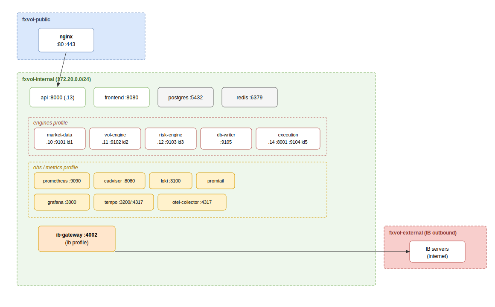

# Local stack

Run the whole platform on a developer machine with Docker Compose. Production
deployment is in [deployment.md](deployment.md); secrets handling in
[secrets.md](secrets.md).



## Topology

The stack spans three bridge networks defined in
[`docker-compose.yml`](../../docker-compose.yml):

| Network | Members | Role |
|---|---|---|
| `fxvol-public` | `nginx` | The only internet-facing lane (:80/:443). |
| `fxvol-internal` | api, frontend, postgres, redis, the 5 engines, ib-gateway, obs services | Back-of-house; not exposed to the LAN by default. |
| `fxvol-external` | `ib-gateway` | Outbound-only lane to reach IB servers. |

`fxvol-internal` pins subnet `172.20.0.0/24` with the dynamic pool confined to
`.128/25`, so the engines keep stable IPs (`.10`–`.14`) that IB Gateway trusts.

## Compose profiles

Services opt into profiles so a bare `docker compose up` stays light (core only:
api + frontend + nginx + postgres + redis):

| Profile | Starts | Flag |
|---|---|---|
| *(none)* | Core: api, frontend, nginx, postgres, redis | — |
| `engines` | market-data, vol-engine, risk-engine, db-writer, execution-engine | `--profile engines` |
| `ib` | ib-gateway | `--profile ib` |
| `obs` | prometheus, cadvisor, loki, promtail, tempo, otel-collector, grafana | `--profile obs` |
| `metrics` | prometheus + cadvisor only (subset of `obs`) | `--profile metrics` |

```powershell
docker compose up -d                              # core only
docker compose --profile engines up -d            # + the 5 Python engines
docker compose --profile obs up -d                # + the LGTM stack
```

The engines need a live IB session to become healthy (their heartbeat
healthchecks fail until the first cycle), so start `ib` alongside `engines` for a
full live run.

## Launchers (`scripts/local/`)

Two PowerShell scripts wrap the lifecycle. Both are **user-run only** — they load
secrets into RAM and are never invoked by tooling. See
[`scripts/local/README.md`](../../scripts/local/README.md).

- [`load_secrets.ps1`](../../scripts/local/load_secrets.ps1) — pulls `/fxvol/prod/*`
  from AWS SSM into the current shell as env vars (RAM only, nothing on disk),
  and derives `DATABASE_URL` / `REDIS_URL` / `PYTHONPATH`. Compose interpolates
  `${DB_PASSWORD:?}` at parse time, so secrets must be loaded before any manual
  `docker compose` command. Run it dot-sourced so the vars persist in the shell.
- [`stack.ps1`](../../scripts/local/stack.ps1) — one entry point for the whole
  container lifecycle. It checks prereqs, creates `.venv` + installs
  `-e ".[dev,api,quant,ib,writer]"`, loads secrets, runs
  `docker compose up -d --build` across `engines`+`ib`+`obs`, waits for Postgres
  healthy, runs `alembic upgrade head`, and restarts nginx.

```powershell
.\scripts\local\stack.ps1                # full stack, build (engines + ib + obs)
.\scripts\local\stack.ps1 -NoBuild       # reuse cached images (daily driver)
.\scripts\local\stack.ps1 -Core          # core only, no engines/ib/obs
.\scripts\local\stack.ps1 -Service api   # rebuild + recreate one service
.\scripts\local\stack.ps1 -Status        # compose ps (status + health)
.\scripts\local\stack.ps1 -Down          # stop (add -DropVolumes to wipe data)
```

Containers build from the **local working tree** (no `git pull`) — the stack
always reflects local code, never GitHub. `-Refresh` reclaims WSL2 RAM without
losing data; `-FullPurge` reclaims disk (images + build cache) but always keeps
the volumes.

## Database migrations

`stack.ps1` runs Alembic automatically after Postgres is healthy. Manually:

```bash
docker compose exec -T api alembic -c src/persistence/alembic.ini upgrade head
docker compose exec -T api alembic -c src/persistence/alembic.ini revision --autogenerate -m "<msg>"
```

## Verify

```powershell
.\scripts\local\stack.ps1 -Status
```

- UI: `http://localhost/`
- API health: `http://localhost/api/v1/health`
- Grafana (with `obs`): `http://localhost:3000/`

Observability queries and the /dev Hardware tab are covered in
[../observability/runbooks.md](../observability/runbooks.md).
