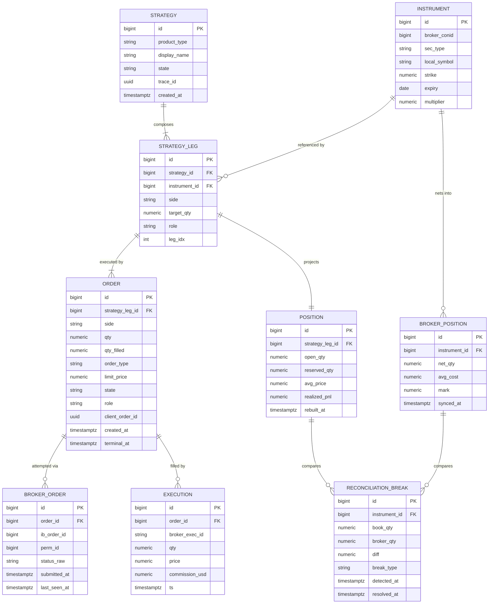
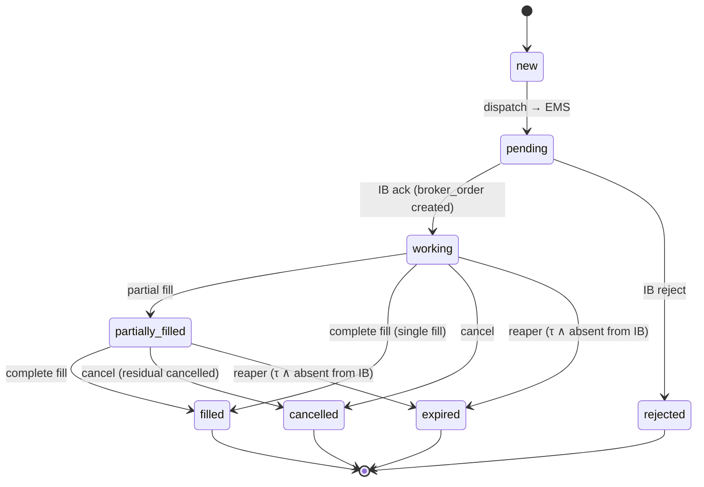

# OMS / position-keeping — target architecture & problem structuring

> Application model for an order / position / structured-product management engine
> between an asynchronous broker (IB) and the application. Written at the scale of
> "1 broker · 1 desk · options + futures + structures · solo", not at the
> multi-tenant level. Goal: make the 4 root defects **impossible by
> construction**, not patchable case by case.

---

## 0. Decision map (TL;DR)

| What you observe | Root defect | Structural fix | Priority |
|---|---|---|---|
| orders `submitted 91h`, phantom qty blocks closes | **D1** no terminalizing FSM | absorbing states + `reaper` (timeout ∧ absent-at-IB) | **P0** |
| legs `— —`, NULL `trade_id`, inverted side | **D2** attribution reconstructed backwards from the netted mirror | **forward** attribution: `execution → order → leg → strategy` (FK, never guessed) | **P1** |
| positions "never closed", book↔IB drift | **D3** the netted mirror serves as display authority | the panel reads the **book projection**; the mirror becomes a reconciliation checksum | **P1** |
| 7 SELLs stacked on 1 lot | **D4** no reservation ledger | materialized `reserved_qty`; `available = open − reserved ≥ 0` (invariant) | **P2** |
| `pending` order never dispatched / dispatched but not stamped | (latent) API→EMS dual-write | idempotency keys + outbox (hardening) | P3 |

**Stopping rule (anti analysis-paralysis)**: P0→P1→P2 are enough for correctness.
P3 = hardening, to be done *only* if you observe the corresponding failure.

---

## 1. System framing — agents, states, transitions

```
agents = { UI(order builder), OMS(api), EMS(exec-engine),
           IB(broker, external/async/adversarial),
           fills_handler, position_projector, position_sync,
           reconciler, reaper }

states      = FSM(order) × state(strategy) × { derived position }
transitions = events : submit, dispatch, ack, fill(partial|complete),
              reject, cancel, timeout, sync, reconcile
```

Key system property: **two truths, a single direction of derivation.**

```
  INTENTION            EXECUTION (truth)          PROJECTION (derived)
  strategy/leg/order → broker_order/execution →  position(book)
                                              ↘  broker_position(mirror)  → reconciliation
```

`execution` (the fill) is the **only** append-only source of truth. Everything else
downstream is a **recomputable projection**: if you destroy `position` and
`broker_position`, you must be able to rebuild them entirely by replaying
`execution`. If that is not the case, you have a hidden source of truth somewhere
— that is an architecture bug.

---

## 2. Constraints (the broker is a hostile agent)

| Constraint | Design consequence |
|---|---|
| IB is **asynchronous**: ack and fills arrive after the HTTP return | no synchronously deduced state; everything goes through the event-driven FSM |
| **partial** and **dribbled** fills (paper: 7/17 over 15 min) | `partially_filled` is a first-class state; never a presumed "filled" |
| IB **nets per contract** (conid) | the mirror is a non-invertible sum → forward attribution mandatory |
| IB may **drop** an order silently / park it `Inactive` | terminalization via **timeout + IB query**, never via trust |
| sync latency ~30 s | the panel cannot read the mirror as real-time truth |
| paper does **not** return bid/ask on some FOPs | pricing at the **held mark**, not at a potentially empty quote |
| possible crash **between** persist and dispatch (dual-write) | idempotency + outbox to make the operation replayable |

ML/systems translation (your framing):
- book↔broker homeostasis = a **controller** whose setpoint is `break = 0`; the
  `reconciler` is the negative feedback loop.
- terminalization = a **liveness** guarantee: every order reaches an absorbing state
  in bounded time τ_max (otherwise divergence — your "91h" is an undamped loop).

---

## 3. Objective function + invariants

### 3.1 Objective
```
min  E[ #orphans + #stuck_orders + |book_broker_drift| + #naked_residuals ]
s.t. never a double-send   (placement idempotency)
     never a phantom-fill  (exec idempotency + cautious reconciliation)
     eventual consistency with IB  (reconciler, if the feed is alive)
```

### 3.2 Invariants — the assertions that must ALWAYS hold
These are your property tests. Each is verifiable in SQL/pytest. A violated
invariant = a localized bug, not an intuition.

```
I1  projection consistency :
    order.qty_filled == Σ execution.qty  WHERE execution.order_id = order.id

I2  liveness / terminalization :
    ∀ order : (now − order.created_at) > τ_max  ⇒  order.state ∈ TERMINAL
    (no live order older than τ_max)

I3  forward attribution :
    position(leg).open_qty == Σ signed(execution.qty)
                              WHERE execution.order.strategy_leg_id = leg.id
    (a leg's position = pure fold of ITS fills, never of the mirror)

I4  reconciliation :
    Σ_leg position(leg).open_qty  per contract
      == broker_position(contract).qty   ± reconciliation_break
    (every discrepancy is materialized as a break, never silent)

I5  no-over-close :
    position(leg).reserved_qty == Σ order.qty
                                  WHERE order.role='closing'
                                    ∧ order.state ∈ {pending,working,partially_filled}
                                    ∧ order targets this leg
    ∧  available = open_qty − reserved_qty ≥ 0

I6  exec idempotency :
    execution.broker_exec_id is UNIQUE  (a fill counted exactly once)

I7  the mirror is never the attribution authority :
    broker_position only appears in reconciliation_break (checksum),
    never read by the panel as the source of who-holds-what.
```

If you implement only one thing from this document: encode `I1`…`I7` as tests.
They prevent you from "freezing" a rework that looks coherent but violates a
property (your blind spot #2).

---

## 4. The 4 root defects — mechanism

### D1 · no terminalizing FSM
`trade_order.state` has **no edge to an absorbing state** triggered by time.
Once `submitted`, no process moves it out of there if IB never fills it
and sends neither cancel nor reject. Result: a persistent live state (`91h`), and its
`qty` keeps counting in the stacking guard → blocks new closes.
*This is a liveness problem, not a correctness one.*

### D2 · attribution reconstructed backwards
`position_sync` reads an IB position that is **already netted** (sum over all structures
sharing a conid) then tries to guess which `trade_id` to attribute it to. Netting
is a **non-invertible** projection: `f(a,b) = a+b` does not allow recovering
`a` and `b`. So attribution is structurally lossy → NULL `trade_id`
(orphan) or wrong (inverted side).

### D3 · the mirror is the display authority
The panel reads `open_position` (the netted mirror, overwritten every 30 s) as
the truth of "what we hold". But this mirror (a) lags by ≤30 s, (b) is
netted so loses attribution, (c) disappears/reappears at the whim of the sync. Hence
the impression of positions "that never close" or "move strangely".

### D4 · no reservation ledger
The qty being closed is not *reserved* on the position. Two quick
clicks both see the full `open_qty` → each sends a full close. The `409`
guard compensates by re-summing on every call, but that is a volatile computation, not
state; it misses races and does not survive a restart.

---

## 5. Target data model

### 5.1 ERD



### 5.2 Spec — grain · single writer · role

| Table | Grain | **Single** writer | Role |
|---|---|---|---|
| `instrument` | 1 / tradeable contract | ref-loader | contract master; **only** join point with IB (`broker_conid`) |
| `strategy` | 1 / structured product | OMS (API) | trade identity (ex-`trade_structure`) |
| `strategy_leg` | 1 / **intentional** leg | OMS (API) | what the structure *wants* to hold (side, target_qty, role) |
| `order` | 1 / order (≈ 1 / leg, or 1 / slice) | OMS (API) writes + FSM update | **intent to execute** + state machine |
| `broker_order` | 1 / external attempt | EMS | the IB attempt(s) (retry/replace) attached to an `order` |
| `execution` | 1 / fill | fills_handler | **SOURCE OF TRUTH** append-only immutable |
| `position` | 1 / `strategy_leg` | position_projector | forward projection = fold(executions) + `reserved_qty` |
| `broker_position` | 1 / netted contract | position_sync | **mirror/checksum** overwritten; never the attribution authority |
| `reconciliation_break` | 1 / discrepancy | reconciler | materializes `I4` (book ⊖ mirror) |

**Single-writer principle**: each table has exactly *one* writing process.
This is what eliminates races. `execution` is only written by `fills_handler`.
`position` is only recomputed by `position_projector`. Etc. Two processes
writing the same table = a source of non-deterministic bugs.

**The split you don't have**: your `trade_order` conflates two things — the *intent*
(what you want to execute, with its FSM) and the *external attempt* (the IB order, with
`ib_order_id`). Separate them: `order` (intent, FSM, belongs to the OMS) vs
`broker_order` (attempt, belongs to the EMS). One `order` can have N
`broker_order` (a cancel-replace, a retry after timeout) without losing its identity.

---

## 6. Order FSM

### 6.1 State diagram



`TERMINAL = { filled, rejected, cancelled, expired }`. Invariant `I2`: every order
reaches TERMINAL in ≤ τ_max.

### 6.2 The reaper — the agent that closes the D1 hole

```python
# runs every REAPER_INTERVAL (e.g. 30s). Idempotent.
def reap():
    if not account_is_reporting():        # never act on a dead feed
        return
    for o in orders_where(state in {working, partially_filled},
                          age > TAU_STALE):        # e.g. 5 min
        at_ib = ems.is_order_live(o.broker_order_id)   # real query to IB
        if at_ib:
            continue                       # legitimately at rest → leave it
        # absent from IB and not (fully) filled :
        held = broker_holds_contract(o)    # does IB hold the contract ?
        if held and matches(o):
            terminalize(o, FILLED)         # missed fill → reconcile (never phantom)
        else:
            terminalize(o, EXPIRED)        # dead → absorbing state
        release_reservation(o)             # frees reserved_qty (see §8)
```

Two non-negotiable safeguards:
1. `account_is_reporting()` — distinguish "IB is flat" from "the feed is dead".
   Acting on an empty snapshot manufactures phantoms. (You already have this function.)
2. We only move to `FILLED` if IB actually holds the corresponding contract —
   otherwise `EXPIRED`. **Never** a presumed fill.

---

## 7. Forward attribution — the position projection

### 7.1 Principle
The per-leg position is a **pure fold over that leg's executions**. The link
`execution → order → strategy_leg → strategy` is known **at fill-write time**
(the `order_id` is in the IB event). It is never reconstructed from the mirror.

```python
def rebuild_position(leg_id):
    fills = executions_where(order.strategy_leg_id == leg_id)   # via FK, exact
    open_qty = Σ signed(f.qty for f in fills)     # signed = +buy / −sell
    avg      = vwap(fills)
    return Position(leg_id, open_qty=open_qty, avg_price=avg,
                    reserved_qty=current_reservation(leg_id))
```

This projection is **O(fills of the leg)** and fully deterministic. It depends
on no IB data. The panel reads THIS (invariant `I7`).

### 7.2 The mirror becomes a checksum
`broker_position` (netted per contract) now serves only **one** purpose: verifying that
your per-contract book sum matches IB.

```python
def reconcile():
    if not account_is_reporting(): return
    for contract in contracts_touched():
        book   = Σ position(leg).open_qty for leg in legs_on(contract)  # your truth
        broker = broker_position(contract).net_qty                      # checksum
        if book != broker:
            upsert_break(contract, book, broker, classify(book, broker))
        else:
            resolve_break(contract)
```

`classify`: `missing_at_ib` (book long, IB flat), `unbooked_at_ib` (IB holds, book
empty), `direction` (opposite signs), `quantity` (|size discrepancy|). The break is
**data**, not an exception — it lives, it gets resolved, it gets audited.

---

## 8. Reservation ledger (D4 fix)

`position` carries two quantities:

```
open_qty     = Σ signed fills             (what IB actually filled for you)
reserved_qty = Σ qty of in-flight closes  (orders role=closing, non-terminal, this leg)
available    = |open_qty| − reserved_qty         # must stay ≥ 0  (I5)
```

Lifecycle of a close:

```
close(leg, q):
    assert q ≤ available(leg)      # otherwise 409 — but now O(1), no re-sum
    reserved_qty(leg) += q         # RESERVES atomically
    create order(role=closing, qty=q, reverse side)

on fill(order role=closing, qf):
    reserved_qty(leg) -= qf        # frees the filled part
    open_qty(leg)     -= qf        # reduces the open qty  (via rebuild)

on terminalize(order role=closing, not fully filled):
    reserved_qty(leg) -= (order.qty − order.qty_filled)   # frees the residual
```

Over-closing is eliminated **by the invariant** `available ≥ 0`, not by a guard that
recounts. Your current `409` guard is the stateless version of the same computation;
materializing it makes it race-free and persistent.

---

## 9. Reconciliation loop — protocol

```
                 ┌─────────────── setpoint : break = 0 ───────────────┐
                 ▼                                                     │
  execution → position(book) ─┐                                       │
                              ├──► reconcile() ──► reconciliation_break┘
  IB positions → broker_pos ──┘         │
                                        ├─ order_reconciler : `working` order
                                        │   whose contract IB holds → FILLED
                                        │   (never phantom : match side+type+strike)
                                        └─ auto-close : book position open but
                                            IB flat >1h ∧ feed alive → close it
```

Three loops, distinct frequencies:
- `reaper` (~30 s): order liveness (§6.2).
- `order_reconciler` (~60 s): book↔order (missed fill → cautious FILLED).
- `reconcile_positions` (~60 s): book↔IB (materializes breaks, guarded auto-close).

All guarded by `account_is_reporting()`.

---

## 10. Idempotency & dual-write (P3 — hardening)

### 10.1 The two idempotency keys
```
client_order_id (uuid)  : generated by the OMS, passed EMS→IB. Dedup at PLACEMENT.
                          → a retry does not create a 2nd IB order.
broker_exec_id (string) : IB fill id. Dedup at execution INSERT (I6).
                          → a replayed event does not count the fill 2×. (you already have it)
```

### 10.2 The dual-write (your latent failure point)
Fragile sequence: `INSERT order(pending)` then `POST ems /submit`. Crash between the
two ⇒ orphan `pending` order (never dispatched) or dispatched but not stamped.

Outbox pattern (if/when you observe the failure):
```
tx:
  INSERT order(state=new)
  INSERT outbox(event=dispatch_order, order_id, client_order_id)   # same transaction
commit
# a dispatcher reads outbox, POSTs EMS, marks outbox sent.
# EMS is idempotent on client_order_id → a double-dispatch is safe.
```
Coordination cost: +1 process (dispatcher), +1 table. Pay it **only** if the
dual-write actually bites you — otherwise it is over-engineering (cf. §14).

### 10.3 Event ordering
A fill can arrive **before** the `broker_order` ack is persisted. The
`fills_handler` must be defensive: upsert the order's state to `working`/`filled`
even if the ack has not yet been seen (it does not presume the ordering of IB events).

---

## 11. Migration path from your current schema

### 11.1 Mapping current → target

| Current | Target | Action |
|---|---|---|
| `trade_structure` | `strategy` | rename / 1:1 |
| `trade_order` | `order` **+** `broker_order` | **split**: FSM+intent vs IB attempt |
| `trade_fill` | `execution` | 1:1 (already append-only ✓ — this is your good building block) |
| `booked_position` | (derived) | removable or replaced by materialized `position(book)` |
| `open_position` | `broker_position` | **demotion**: stop reading it for display |
| `trade_preview` | same | keep |
| `trade_event` | (event log) | keep; becomes the audit |
| `hedge_order` | `order(role='hedge')` | fold into `order` via `role`, or keep separate |
| — | `position` (+ open/reserved) | **new**: forward projection |
| — | `reconciliation_break` | **new** (or derived from your `/reconciliation`) |

### 11.2 Behavior changes (the 4 that matter)
1. **Add terminal FSM + reaper** → kills `91h` and frees blocked closes. (P0)
2. **Panel reads `position(book)`**, no longer `broker_position`. → kills display drift. (P1)
3. **Forward attribution**: `position` built from `execution.order.strategy_leg`,
   never guessed. → kills orphans/side. (P1)
4. **Materialized `reserved_qty`** replaces the stateless `409` guard. → kills stacking. (P2)

### 11.3 Execution order (respects your "never a 70% repo" rule)
```
1. write I1..I7 as tests (fail on the current schema — baseline)
2. P0 : FSM.terminal + reaper                → tests I2 pass
3. P1 : forward position_projector + panel   → tests I3, I7 pass
4. P1 : reconcile() → materialized break     → tests I4 pass
5. P2 : reserved_qty + available guard       → tests I5 pass
6. tag v1.0   (STOP — correctness reached)
7. (optional) P3 outbox if dual-write observed
```

---

## 12. Minimal viable correctness threshold

**Honest question to ask yourself (anti over-optimization, #5)**: do you need
full event-sourcing + CQRS + outbox + saga? No, not at this scale. The
"correct" frontier is reached when `I1..I5` hold. `I6` you already have.
`I7` is a read-path change, not infra. The rest (P3) is hardening
whose marginal benefit is only justified under an observed failure frequency.

```
correctness      = P0 + P1 + P2         (≈ 4-6 d)   ← stop here
hardening        = P3                    (on demand, on measured failure)
over-engineering = full CQRS, multi-broker, sharding   ← not your scale
```

---

## 13. Test scenarios (properties to verify)

| # | Scenario | Expected property |
|---|---|---|
| T1 | `working` order, no fill, τ exceeded, IB does not hold it | reaper → `expired`, `reserved` freed (I2, I5) |
| T2 | `working` order, IB actually filled it but the event was missed | order_reconciler → `filled` (never phantom if contract absent) |
| T3 | 2 structures same conid, one long one short | exact per-leg `position` via FK; `broker_position` = sum; break=0 (I3,I4) |
| T4 | rapid double-click close | 2nd close refused if `q > available` (I5) |
| T5 | partial fill 7/17 then cancel of the residual | `qty_filled=7`, `open` reduced by 7, `reserved` freed of the rest (I1,I5) |
| T6 | same `broker_exec_id` replayed | 0 duplicated executions (I6) |
| T7 | IB feed cut (empty snapshot) | reaper/auto-close **do not act** (`account_is_reporting` guard) |
| T8 | destroy `position`+`broker_position`, replay `execution` | projection rebuilt identically ("pure projection" test) |

---

## 14. Externalities & risks (separate section)

- **Coordination cost**: moving to N writer processes + outbox + dispatcher
  adds failure points and end-to-end latency. Real benefit
  only under a non-negligible failure frequency. Do not pay it in advance.
- **Over-optimization (descriptive→prescriptive trap)**: the "cleanest"
  architecture (full event-sourcing) is seductive *on paper* and suboptimal
  *in your real life* at this scale. The criterion is not elegance, it is
  `I1..I5` green at minimal cost.
- **Premature closure**: once `I1..I7` are written as tests, do not freeze the
  rework until they all pass; they, not the perceived coherence of the
  design, are what validates it.
- **Phantom-fill risk**: any reconciliation that moves an order to `filled`
  MUST match a contract actually held at IB. That is the only safeguard between
  "reconciling" and "manufacturing a position".
