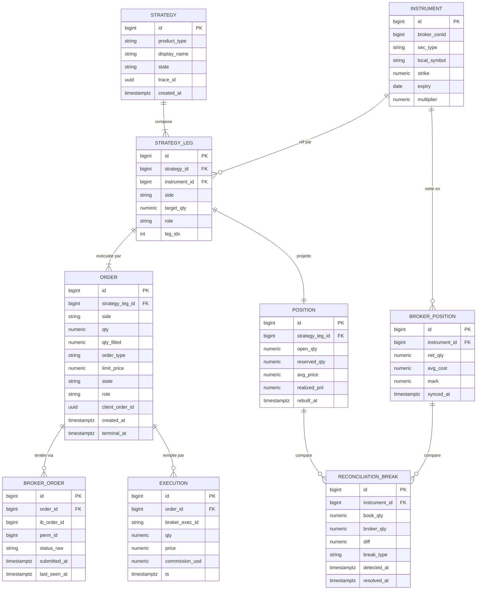
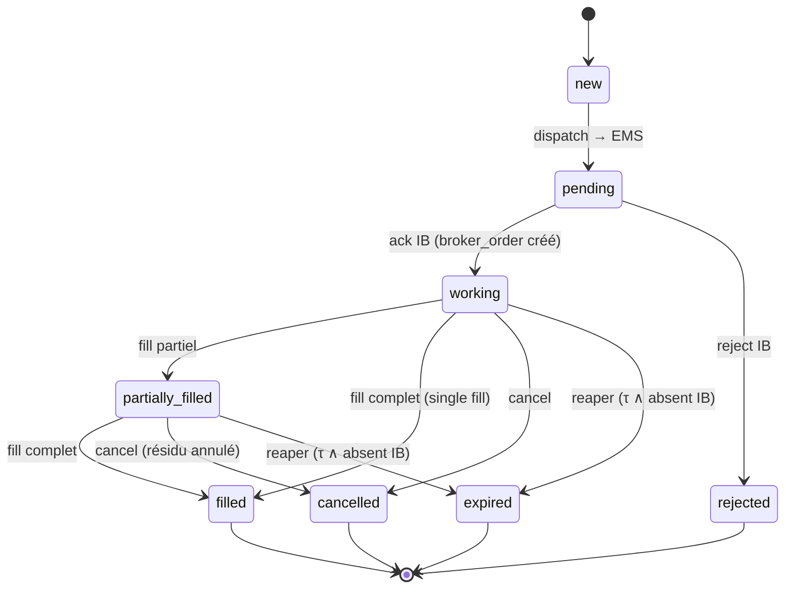

# OMS / position-keeping — architecture cible & structuration du problème

> Modèle applicatif d'un moteur de gestion ordres / positions / produits structurés
> entre un broker asynchrone (IB) et l'application. Écrit au niveau d'échelle
> « 1 broker · 1 desk · options + futures + structures · solo », pas au niveau
> multi-tenant. Objectif : rendre les 4 défauts racines **impossibles par
> construction**, pas patchables au cas par cas.

---

## 0. Carte des décisions (TL;DR)

| Ce que tu observes | Défaut racine | Correctif structurel | Priorité |
|---|---|---|---|
| ordres `submitted 91h`, qty fantôme bloque les closes | **D1** pas de FSM terminalisante | états absorbants + `reaper` (timeout ∧ absent-chez-IB) | **P0** |
| legs `— —`, `trade_id` NULL, side inversé | **D2** attribution reconstruite à rebours depuis le miroir netté | attribution **forward** : `execution → order → leg → strategy` (FK, jamais deviné) | **P1** |
| positions « jamais fermées », drift book↔IB | **D3** le miroir netté sert d'autorité d'affichage | le panel lit la **projection book** ; le miroir devient checksum de réconciliation | **P1** |
| 7 SELL empilés sur 1 lot | **D4** pas de ledger de réservation | `reserved_qty` matérialisé ; `available = open − reserved ≥ 0` (invariant) | **P2** |
| ordre `pending` jamais dispatché / dispatché non stampé | (latent) dual-write API→EMS | clés d'idempotence + outbox (durcissement) | P3 |

**Règle d'arrêt (anti-analyse-paralysie)** : P0→P1→P2 suffisent à la correction.
P3 = durcissement, à faire *seulement* si tu observes la panne correspondante.

---

## 1. Cadre système — agents, états, transitions

```
agents = { UI(order builder), OMS(api), EMS(exec-engine),
           IB(broker, externe/async/adversarial),
           fills_handler, position_projector, position_sync,
           reconciler, reaper }

états    = FSM(order) × état(strategy) × { position dérivée }
transitions = évènements : submit, dispatch, ack, fill(partiel|complet),
              reject, cancel, timeout, sync, reconcile
```

Propriété clé du système : **deux vérités, un seul sens de dérivation.**

```
  INTENTION            EXÉCUTION (vérité)         PROJECTION (dérivé)
  strategy/leg/order → broker_order/execution →  position(book)
                                              ↘  broker_position(miroir)  → reconciliation
```

`execution` (le fill) est la **seule** source de vérité append-only. Tout le reste
en aval est une **projection recalculable** : si tu détruis `position` et
`broker_position`, tu dois pouvoir les reconstruire intégralement en rejouant
`execution`. Si ce n'est pas le cas, tu as une source de vérité cachée quelque part
— c'est un bug d'architecture.

---

## 2. Contraintes (le broker est un agent hostile)

| Contrainte | Conséquence de design |
|---|---|
| IB est **asynchrone** : ack et fills arrivent après le retour HTTP | pas d'état déduit synchroniquement ; tout passe par la FSM pilotée par events |
| fills **partiels** et **dribblés** (paper : 7/17 sur 15 min) | `partially_filled` est un état de première classe ; jamais « filled » présumé |
| IB **nette par contrat** (conid) | le miroir est une somme non-inversible → attribution forward obligatoire |
| IB peut **droper** un ordre silencieusement / le parquer `Inactive` | terminalisation par **timeout + requête IB**, jamais par confiance |
| latence de sync ~30 s | le panel ne peut pas lire le miroir comme vérité temps-réel |
| paper ne renvoie **pas** de bid/ask sur certains FOP | pricing au **mark détenu**, pas à un quote potentiellement vide |
| crash possible **entre** persist et dispatch (dual-write) | idempotence + outbox pour rendre l'opération rejouable |

Traduction ML/systèmes (ton cadre) :
- homéostasie book↔broker = **contrôleur** dont le setpoint est `break = 0` ; le
  `reconciler` est la boucle de rétroaction négative.
- terminalisation = garantie de **liveness** : tout ordre atteint un état absorbant
  en temps borné τ_max (sinon divergence — ton « 91h » est une boucle sans amortissement).

---

## 3. Fonction objectif + invariants

### 3.1 Objectif
```
min  E[ #orphelins + #ordres_bloqués + |drift_book_broker| + #naked_residuals ]
s.t. jamais de double-envoi  (idempotence placement)
     jamais de phantom-fill   (idempotence exec + réconciliation prudente)
     cohérence éventuelle avec IB  (reconciler, si feed vivant)
```

### 3.2 Invariants — les assertions qui doivent TOUJOURS tenir
Ce sont tes tests de propriété. Chacun est vérifiable en SQL/pytest. Un invariant
violé = un bug localisé, pas une intuition.

```
I1  consistance projection :
    order.qty_filled == Σ execution.qty  WHERE execution.order_id = order.id

I2  liveness / terminalisation :
    ∀ order : (now − order.created_at) > τ_max  ⇒  order.state ∈ TERMINAL
    (aucun ordre vivant plus vieux que τ_max)

I3  attribution forward :
    position(leg).open_qty == Σ signed(execution.qty)
                              WHERE execution.order.strategy_leg_id = leg.id
    (la position d'une jambe = pur fold de SES fills, jamais du miroir)

I4  réconciliation :
    Σ_leg position(leg).open_qty  par contrat
      == broker_position(contrat).qty   ± reconciliation_break
    (tout écart est matérialisé comme break, jamais silencieux)

I5  non-sur-close :
    position(leg).reserved_qty == Σ order.qty
                                  WHERE order.role='closing'
                                    ∧ order.state ∈ {pending,working,partially_filled}
                                    ∧ order cible ce leg
    ∧  available = open_qty − reserved_qty ≥ 0

I6  idempotence exec :
    execution.broker_exec_id est UNIQUE  (un fill compté une seule fois)

I7  le miroir n'est jamais autorité d'attribution :
    broker_position n'apparaît que dans reconciliation_break (checksum),
    jamais lu par le panel comme source de qui-détient-quoi.
```

Si tu n'implémentes qu'une chose de ce document : encode `I1`…`I7` comme tests.
Ils t'empêchent de « figer » une refonte qui a l'air cohérente mais viole une
propriété (ton angle mort #2).

---

## 4. Les 4 défauts racines — mécanisme

### D1 · pas de FSM terminalisante
`trade_order.state` n'a **pas d'arête vers un état absorbant** déclenchée par le
temps. Une fois `submitted`, aucun processus ne le sort de là si IB ne fill jamais
et n'envoie ni cancel ni reject. Résultat : état vivant persistant (`91h`), et sa
`qty` continue de compter dans le garde de stacking → bloque les nouveaux closes.
*C'est un problème de liveness, pas de correctness.*

### D2 · attribution reconstruite à rebours
`position_sync` lit une position IB **déjà nettée** (somme sur toutes les structures
partageant un conid) puis tente de deviner à quelle `trade_id` l'attribuer. Le
netting est une projection **non-inversible** : `f(a,b) = a+b` ne permet pas de
retrouver `a` et `b`. Donc l'attribution est structurellement lossy → `trade_id`
NULL (orphelin) ou faux (side inversé).

### D3 · le miroir est l'autorité d'affichage
Le panel lit `open_position` (le miroir netté, écrasé toutes les 30 s) comme
vérité de « ce qu'on détient ». Or ce miroir (a) est en retard de ≤30 s, (b) est
netté donc perd l'attribution, (c) disparaît/réapparaît au gré de la sync. D'où
l'impression de positions « qui ne se ferment pas » ou « bougent bizarrement ».

### D4 · pas de ledger de réservation
La qty en cours de fermeture n'est pas *réservée* sur la position. Deux clics
rapides voient tous deux `open_qty` plein → chacun envoie un close plein. Le garde
`409` compense en re-sommant à chaque appel, mais c'est un calcul volatil, pas un
état ; il rate les courses et ne survit pas au redémarrage.

---

## 5. Modèle de données cible

### 5.1 ERD



### 5.2 Spec — grain · writer unique · rôle

| Table | Grain | Writer **unique** | Rôle |
|---|---|---|---|
| `instrument` | 1 / contrat tradeable | ref-loader | contract master ; **seul** point de jointure avec IB (`broker_conid`) |
| `strategy` | 1 / produit structuré | OMS (API) | identité du trade (ex-`trade_structure`) |
| `strategy_leg` | 1 / jambe **intentionnelle** | OMS (API) | ce que la structure *veut* détenir (side, target_qty, role) |
| `order` | 1 / ordre (≈ 1 / leg, ou 1 / slice) | OMS (API) écrit + FSM update | **intention d'exécuter** + machine à états |
| `broker_order` | 1 / tentative externe | EMS | la ou les tentatives IB (retry/replace) rattachées à un `order` |
| `execution` | 1 / fill | fills_handler | **SOURCE DE VÉRITÉ** append-only immuable |
| `position` | 1 / `strategy_leg` | position_projector | projection forward = fold(executions) + `reserved_qty` |
| `broker_position` | 1 / contrat netté | position_sync | **miroir/checksum** écrasé ; jamais autorité d'attribution |
| `reconciliation_break` | 1 / écart | reconciler | matérialise `I4` (book ⊖ miroir) |

**Principe du writer unique** : chaque table a exactement *un* processus écrivain.
C'est ce qui élimine les courses. `execution` n'est écrite que par `fills_handler`.
`position` n'est recalculée que par `position_projector`. Etc. Deux processus qui
écrivent la même table = source de bug non-déterministe.

**Le split que tu n'as pas** : ton `trade_order` conflate deux choses — l'*intention*
(ce que tu veux exécuter, avec sa FSM) et la *tentative externe* (l'ordre IB, avec
`ib_order_id`). Sépare-les : `order` (intention, FSM, appartient à l'OMS) vs
`broker_order` (tentative, appartient à l'EMS). Un `order` peut avoir N
`broker_order` (un cancel-replace, un retry après timeout) sans perdre son identité.

---

## 6. FSM de l'ordre

### 6.1 Diagramme d'états



`TERMINAL = { filled, rejected, cancelled, expired }`. Invariant `I2` : tout ordre
atteint TERMINAL en ≤ τ_max.

### 6.2 Le reaper — l'agent qui ferme le trou D1

```python
# tourne toutes les REAPER_INTERVAL (ex: 30s). Idempotent.
def reap():
    if not account_is_reporting():        # ne jamais agir sur un feed mort
        return
    for o in orders_where(state in {working, partially_filled},
                          age > TAU_STALE):        # ex: 5 min
        at_ib = ems.is_order_live(o.broker_order_id)   # requête réelle à IB
        if at_ib:
            continue                       # légitimement au repos → laisser
        # absent d'IB et pas (complètement) fillé :
        held = broker_holds_contract(o)    # IB détient-il le contrat ?
        if held and matches(o):
            terminalize(o, FILLED)         # fill manqué → réconcilie (jamais phantom)
        else:
            terminalize(o, EXPIRED)        # mort → état absorbant
        release_reservation(o)             # libère reserved_qty (voir §8)
```

Deux garde-fous non négociables :
1. `account_is_reporting()` — distinguer « IB est flat » de « le feed est mort ».
   Agir sur un snapshot vide fabrique des fantômes. (Tu as déjà cette fonction.)
2. On ne passe à `FILLED` que si IB détient réellement le contrat correspondant —
   sinon `EXPIRED`. **Jamais** de fill présumé.

---

## 7. Attribution forward — la projection de position

### 7.1 Principe
La position par jambe est un **pur fold sur les executions de cette jambe**. Le lien
`execution → order → strategy_leg → strategy` est connu **à l'écriture du fill**
(l'`order_id` est dans l'event IB). On ne le reconstruit jamais depuis le miroir.

```python
def rebuild_position(leg_id):
    fills = executions_where(order.strategy_leg_id == leg_id)   # via FK, exact
    open_qty = Σ signed(f.qty for f in fills)     # signed = +buy / −sell
    avg      = vwap(fills)
    return Position(leg_id, open_qty=open_qty, avg_price=avg,
                    reserved_qty=current_reservation(leg_id))
```

Cette projection est **O(fills de la jambe)** et totalement déterministe. Elle ne
dépend d'aucune donnée IB. Le panel lit CECI (invariant `I7`).

### 7.2 Le miroir devient un checksum
`broker_position` (netté par contrat) ne sert plus qu'à **une** chose : vérifier que
ta somme book par contrat matche IB.

```python
def reconcile():
    if not account_is_reporting(): return
    for contract in contracts_touched():
        book   = Σ position(leg).open_qty for leg in legs_on(contract)  # ta vérité
        broker = broker_position(contract).net_qty                      # checksum
        if book != broker:
            upsert_break(contract, book, broker, classify(book, broker))
        else:
            resolve_break(contract)
```

`classify` : `missing_at_ib` (book long, IB flat), `unbooked_at_ib` (IB détient, book
vide), `direction` (signes opposés), `quantity` (|écart| de taille). Le break est une
**donnée**, pas une exception — il vit, il se résout, il s'audite.

---

## 8. Ledger de réservation (correctif D4)

`position` porte deux quantités :

```
open_qty     = Σ signed fills           (ce qu'IB t'a réellement rempli)
reserved_qty = Σ qty des closes en vol  (ordres role=closing, non terminaux, ce leg)
available    = |open_qty| − reserved_qty         # doit rester ≥ 0  (I5)
```

Cycle de vie d'un close :

```
close(leg, q):
    assert q ≤ available(leg)      # sinon 409 — mais désormais O(1), pas re-somme
    reserved_qty(leg) += q         # RÉSERVE atomiquement
    create order(role=closing, qty=q, reverse side)

on fill(order role=closing, qf):
    reserved_qty(leg) -= qf        # libère la part fillée
    open_qty(leg)     -= qf        # réduit l'ouvert  (via rebuild)

on terminalize(order role=closing, non entièrement fillé):
    reserved_qty(leg) -= (order.qty − order.qty_filled)   # libère le résidu
```

Le sur-close est éliminé **par l'invariant** `available ≥ 0`, pas par un garde qui
recompte. Ton garde `409` actuel est la version stateless du même calcul ; le
matérialiser le rend race-free et persistant.

---

## 9. Boucle de réconciliation — protocole

```
                 ┌─────────────── setpoint : break = 0 ───────────────┐
                 ▼                                                     │
  execution → position(book) ─┐                                       │
                              ├──► reconcile() ──► reconciliation_break┘
  IB positions → broker_pos ──┘         │
                                        ├─ order_reconciler : ordre `working`
                                        │   dont IB détient le contrat → FILLED
                                        │   (jamais phantom : match side+type+strike)
                                        └─ auto-close : position book ouverte mais
                                            IB flat >1h ∧ feed vivant → clôture
```

Trois boucles, fréquences distinctes :
- `reaper` (~30 s) : liveness des ordres (§6.2).
- `order_reconciler` (~60 s) : book↔ordre (fill manqué → FILLED prudent).
- `reconcile_positions` (~60 s) : book↔IB (matérialise les breaks, auto-close gardé).

Toutes gardées par `account_is_reporting()`.

---

## 10. Idempotence & dual-write (P3 — durcissement)

### 10.1 Les deux clés d'idempotence
```
client_order_id (uuid)  : généré par l'OMS, passé EMS→IB. Dédup au PLACEMENT.
                          → un retry ne crée pas un 2e ordre IB.
broker_exec_id (string) : id du fill IB. Dédup à l'INSERT execution (I6).
                          → un event rejoué ne compte pas 2× le fill. (tu l'as déjà)
```

### 10.2 Le dual-write (ton point de défaillance latent)
Séquence fragile : `INSERT order(pending)` puis `POST ems /submit`. Crash entre les
deux ⇒ ordre `pending` orphelin (jamais dispatché) ou dispatché non stampé.

Pattern outbox (si/quand tu observes la panne) :
```
tx:
  INSERT order(state=new)
  INSERT outbox(event=dispatch_order, order_id, client_order_id)   # même transaction
commit
# un dispatcher lit outbox, POST EMS, marque outbox envoyé.
# EMS est idempotent sur client_order_id → un double-dispatch est sûr.
```
Coût de coordination : +1 processus (dispatcher), +1 table. À ne payer **que** si le
dual-write te mord réellement — sinon c'est de la sur-ingénierie (cf. §14).

### 10.3 Ordonnancement des events
Un fill peut arriver **avant** que l'ack du `broker_order` soit persisté. Le
`fills_handler` doit être défensif : upsert l'état de l'ordre vers `working`/`filled`
même si l'ack n'est pas encore vu (il ne présume pas l'ordre des events IB).

---

## 11. Chemin de migration depuis ton schéma actuel

### 11.1 Mapping ancien → cible

| Actuel | Cible | Action |
|---|---|---|
| `trade_structure` | `strategy` | renommage / 1:1 |
| `trade_order` | `order` **+** `broker_order` | **split** : FSM+intention vs tentative IB |
| `trade_fill` | `execution` | 1:1 (déjà append-only ✓ — c'est ta bonne brique) |
| `booked_position` | (dérivé) | supprimable ou remplacé par `position(book)` matérialisée |
| `open_position` | `broker_position` | **démotion** : cesse de le lire comme affichage |
| `trade_preview` | idem | conserver |
| `trade_event` | (event log) | conserver ; devient l'audit |
| `hedge_order` | `order(role='hedge')` | fold dans `order` via `role`, ou garder séparé |
| — | `position` (+ open/reserved) | **nouveau** : projection forward |
| — | `reconciliation_break` | **nouveau** (ou dérivé de ton `/reconciliation`) |

### 11.2 Changements de comportement (les 4 qui comptent)
1. **Ajouter FSM terminale + reaper** → tue `91h` et libère les closes bloqués. (P0)
2. **Panel lit `position(book)`**, plus `broker_position`. → tue le drift d'affichage. (P1)
3. **Attribution forward** : `position` construite depuis `execution.order.strategy_leg`,
   jamais devinée. → tue orphelins/side. (P1)
4. **`reserved_qty` matérialisé** remplace le garde `409` stateless. → tue l'empilement. (P2)

### 11.3 Ordre d'exécution (respecte ta règle « jamais de repo à 70 % »)
```
1. écrire I1..I7 comme tests (échouent sur le schéma actuel — baseline)
2. P0 : FSM.terminal + reaper                → tests I2 passent
3. P1 : position_projector forward + panel   → tests I3, I7 passent
4. P1 : reconcile() → break matérialisé      → tests I4 passent
5. P2 : reserved_qty + available guard       → tests I5 passent
6. tag v1.0   (STOP — correction atteinte)
7. (optionnel) P3 outbox si dual-write observé
```

---

## 12. Seuil de correction minimal viable

**Question honnête à te poser (anti sur-optimisation, #5)** : as-tu besoin de
l'event-sourcing complet + CQRS + outbox + saga ? Non, pas à cette échelle. La
frontière « correct » est atteinte quand `I1..I5` tiennent. `I6` tu l'as déjà.
`I7` est un changement de lecture, pas d'infra. Le reste (P3) est du durcissement
dont le bénéfice marginal ne se justifie que sous une fréquence de panne observée.

```
correction   = P0 + P1 + P2         (≈ 4-6 j)   ← t'arrêter ici
durcissement = P3                    (à la demande, sur panne mesurée)
sur-ingénierie = CQRS complet, multi-broker, sharding   ← pas ton échelle
```

---

## 13. Scénarios de test (propriétés à vérifier)

| # | Scénario | Propriété attendue |
|---|---|---|
| T1 | ordre `working`, aucun fill, τ dépasse, IB ne le détient pas | reaper → `expired`, `reserved` libéré (I2, I5) |
| T2 | ordre `working`, IB l'a en fait fillé mais event manqué | order_reconciler → `filled` (jamais phantom si contrat absent) |
| T3 | 2 structures même conid, une longue une courte | `position` par leg exacte via FK ; `broker_position` = somme ; break=0 (I3,I4) |
| T4 | double-clic close rapide | 2e close refusé si `q > available` (I5) |
| T5 | fill partiel 7/17 puis cancel du résidu | `qty_filled=7`, `open` réduit de 7, `reserved` libéré du reste (I1,I5) |
| T6 | même `broker_exec_id` rejoué | 0 execution dupliquée (I6) |
| T7 | feed IB coupé (snapshot vide) | reaper/auto-close **n'agissent pas** (garde `account_is_reporting`) |
| T8 | détruire `position`+`broker_position`, rejouer `execution` | projection reconstruite à l'identique (test de « projection pure ») |

---

## 14. Externalités & risques (section séparée)

- **Coût de coordination** : passer à N processus writer + outbox + dispatcher
  ajoute des points de défaillance et de la latence de bout-en-bout. Bénéfice réel
  seulement sous fréquence de panne non-négligeable. Ne pas payer par anticipation.
- **Sur-optimisation (piège descriptif→prescriptif)** : l'architecture « la plus
  propre » (event-sourcing intégral) est séduisante *sur le papier* et sous-optimale
  *dans ta vraie vie* à cette échelle. Le critère n'est pas l'élégance, c'est
  `I1..I5` verts au coût minimal.
- **Fermeture prématurée** : une fois `I1..I7` écrits comme tests, ne fige pas la
  refonte tant qu'ils ne passent pas tous ; ce sont eux, pas la cohérence perçue du
  design, qui valident.
- **Risque de phantom fill** : toute réconciliation qui passe un ordre à `filled`
  DOIT matcher un contrat réellement détenu chez IB. C'est le seul garde-fou entre
  « réconcilier » et « fabriquer une position ».
```
