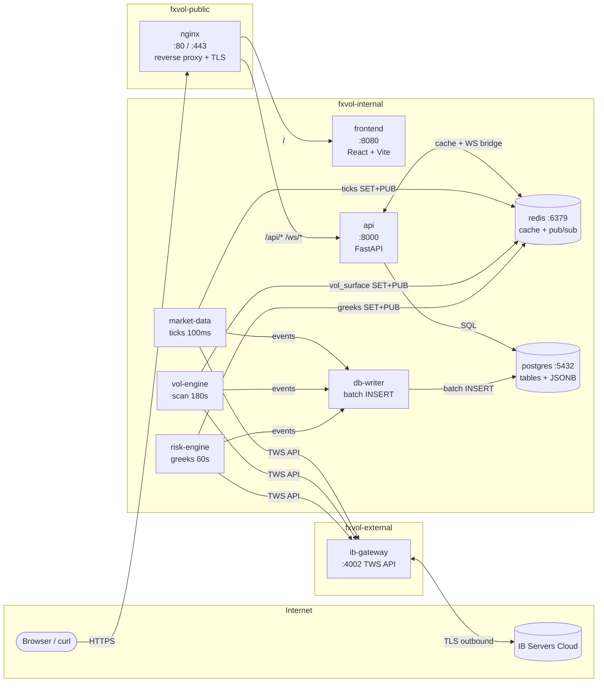

# Containers — vue simplifiée des liens

> Vue d'ensemble des **11 containers Docker** de la stack fxvol et de leurs interactions.
> Diagramme éditable : [`containers-overview.drawio`](./containers-overview.drawio).

---

## Diagramme

---

## Les 11 containers

| Container | Rôle | Stack |
|---|---|---|
| `nginx` | Reverse proxy public, terminaison TLS, routing `/api`, `/ws`, `/` | nginx + Let's Encrypt |
| `frontend` | Dashboard React (build statique servi en interne) | React + Vite + TypeScript + Plotly |
| `api` | Backend REST + WebSocket, lit DB et cache, écrit `vol_config` | FastAPI + asyncio + SQLAlchemy |
| `postgres` | Stockage long-terme (positions, trades, snapshots, vol surfaces, signals, backtests) | PostgreSQL 16 + extension `pg_stat_statements` |
| `redis` | Cache live (TTL 30-600s) + bus pub/sub temps réel | Redis 7 |
| `market-data` | Ingestion des ticks IB en continu (~100ms) | Python + ib_insync |
| `vol-engine` | Scan IV + fit smile (SVI/SSVI) + GARCH fair vol toutes les ~180s | Python + scipy + arch |
| `risk-engine` | Greeks portfolio agrégés et P&L décomposé toutes les ~60s | Python + scipy |
| `db-writer` | Buffer asynchrone qui batche les events des engines vers Postgres (50 rows / 500ms) | Python + asyncio |
| `ib-gateway` | Bridge containerisé vers Interactive Brokers (Java + IBC auto-login + Xvfb headless) | Image Java |
| *Browser / IB Cloud* | Externes au compose (clients du système) | n/a |

---

## Les 3 networks

| Network | Containers | Pourquoi cette segmentation |
|---|---|---|
| **`fxvol-public`** | `nginx` uniquement | Surface d'attaque minimale exposée à internet (port 80/443 seulement) |
| **`fxvol-internal`** | `api`, `frontend`, `postgres`, `redis`, `market-data`, `vol-engine`, `risk-engine`, `db-writer` | Back-of-house : aucun de ces containers n'est joignable depuis internet, même si nginx était mal configuré (defense in depth) |
| **`fxvol-external`** | `ib-gateway` | Lane outbound dédiée pour le trafic IB en TLS — isole `ib-gateway` du reste pour qu'une compromission broker ne donne pas accès à Postgres |

En dev, l'override `docker-compose.override.yml` expose en plus `postgres :5433` et `redis :6380` sur l'host pour `psql` / `redis-cli` / les notebooks Jupyter. En **prod**, ces ports n'existent pas — uniquement le 80/443 via nginx.

---

## Lecture des flèches

- **Read path** (depuis le navigateur) : `Browser → nginx → api → postgres + redis`. Le frontend React fetche `/api/*` (REST) et abonne `/ws/*` (live ticks/vol/risk).
- **Write path** (depuis IB) : `IB Cloud → ib-gateway → engines → redis (cache live) + db-writer → postgres (history)`. Les engines écrivent dans Redis pour le streaming UI (TTL court) et empilent en parallèle des events sur la queue async du `db-writer` qui batche les INSERT vers Postgres.

---

## Liens

- Architecture cible v2 (référence canonique) : [`../../releases/architecture_finale_project/00-architecture-main.md`](../../releases/architecture_finale_project/00-architecture-main.md)
- Schéma DB détaillé : [`postgres-architecture.md`](./postgres-architecture.md) + [`postgres-architecture.drawio`](./postgres-architecture.drawio)
- Catalogue des endpoints API : [`../API_ENDPOINTS.md`](../API_ENDPOINTS.md)
