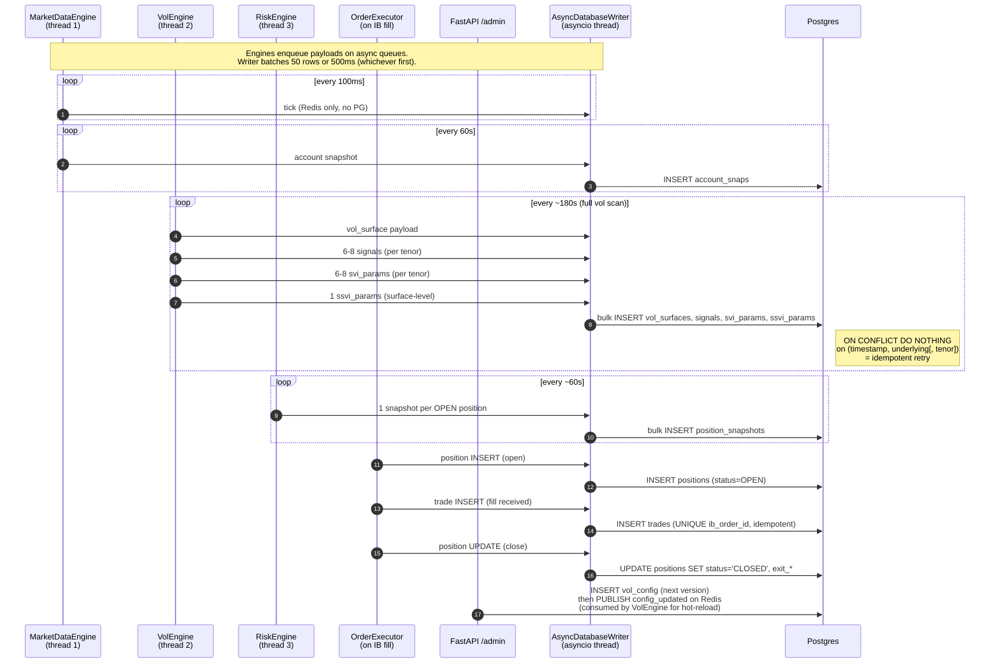

# Postgres architecture — schéma + cycles d'écriture

> Source de vérité : `src/persistence/models.py` + migrations `src/persistence/migrations/versions/`.
> Diagramme éditable : [`postgres-architecture.drawio`](./postgres-architecture.drawio) (ouvre dans <https://app.diagrams.net> ou l'extension VS Code "Draw.io Integration").
> **Outils opérationnels** : `scripts/postgresql/01_reset.ipynb` (TRUNCATE/DROP), `02_setup.ipynb` (Alembic + seed `vol_config` v1), `03_test_crud.ipynb` (CRUD smoke par table).

---

## 1. Diagramme ER (Mermaid, rendu natif GitHub)

```mermaid
erDiagram
    positions ||--o{ position_snapshots : "1→N (FK plain, ORM cascade)"
    positions ||--o{ trades : "1→N (FK nullable, no cascade)"

    positions {
        int id PK
        varchar(20) symbol
        enum instrument_type "SPOT|FUTURE|OPTION"
        enum side "BUY|SELL"
        numeric quantity "15,4"
        numeric strike "10,5 NULL"
        date maturity "NULL"
        enum option_type "CALL|PUT NULL"
        numeric entry_price "15,8"
        timestamptz entry_timestamp
        numeric exit_price "NULL"
        timestamptz exit_timestamp "NULL"
        enum status "OPEN|CLOSED|EXPIRED"
        timestamptz created_at
        timestamptz updated_at
    }

    position_snapshots {
        int id PK
        int position_id FK
        timestamptz timestamp
        numeric spot "NULL"
        numeric iv "NULL"
        numeric delta_usd "NULL"
        numeric vega_usd "NULL"
        numeric gamma_usd "NULL"
        numeric theta_usd "NULL"
        numeric pnl_usd "NULL"
    }

    trades {
        int id PK
        int position_id FK "NULL"
        varchar(50) ib_order_id UK
        enum side "BUY|SELL"
        numeric quantity "15,4"
        numeric price "15,8"
        numeric commission "NULL"
        timestamptz timestamp
        numeric spot_at_execution "NULL"
        numeric iv_at_execution "NULL"
    }

    account_snaps {
        int id PK
        timestamptz timestamp
        numeric net_liq_usd "NULL"
        numeric cash_usd "NULL"
        numeric buying_power_usd "NULL"
        numeric available_usd "NULL"
        numeric unrealized_pnl_usd "NULL"
        numeric realized_pnl_usd "NULL"
        numeric gross_position_value_usd "NULL"
        jsonb currencies "NULL"
        int open_positions_count "NULL"
    }

    vol_surfaces {
        int id PK
        timestamptz timestamp UK1
        varchar(20) underlying UK1
        numeric spot "15,8"
        numeric forward "NULL"
        jsonb surface_data "ATM + smile pillars"
        jsonb fair_vol_data "GARCH output NULL"
        jsonb rv_data "Yang-Zhang RV history NULL"
        numeric scan_duration_s "NULL"
    }

    signals {
        int id PK
        timestamptz timestamp UK2
        varchar(20) underlying UK2
        varchar(5) tenor UK2
        int dte
        numeric sigma_mid "8,5 — IV from market"
        numeric sigma_fair "8,5 — fair vol model"
        numeric ecart "8,5 — sigma_mid - sigma_fair"
        enum signal_type "CHEAP|EXPENSIVE|FAIR"
        numeric rv "NULL — realized vol"
    }

    svi_params {
        int id PK
        timestamptz timestamp UK3
        varchar(20) underlying UK3
        varchar(5) tenor UK3
        numeric a "10,7"
        numeric b "10,7"
        numeric rho "10,7 — skew"
        numeric m "10,7"
        numeric sigma "10,7"
        numeric rmse_fit "NULL"
        numeric butterfly_g_min "NULL — arb check"
    }

    ssvi_params {
        int id PK
        timestamptz timestamp UK4
        varchar(20) underlying UK4
        numeric spot "15,8"
        numeric eta "10,7"
        numeric gamma "10,7"
        numeric rho "10,7 — surface skew"
        numeric rmse_fit "NULL"
        bool calendar_arb_free "NULL"
    }

    backtest_runs {
        int id PK
        varchar(50) strategy_name
        jsonb parameters "config snapshot"
        date start_date
        date end_date
        numeric sharpe_ratio "NULL"
        numeric sortino_ratio "NULL"
        numeric max_drawdown_pct "NULL"
        int max_drawdown_duration_days "NULL"
        numeric hit_rate "NULL"
        numeric total_return_pct "NULL"
        numeric annualized_return_pct "NULL"
        numeric annualized_vol_pct "NULL"
        int n_trades "NULL"
        numeric avg_holding_period_days "NULL"
        numeric profit_factor "NULL"
        jsonb equity_curve "NULL"
        jsonb trades_log "NULL"
        timestamptz created_at
    }

    vol_config {
        int version PK "auto-incr per PUT"
        jsonb config "VolTradingConfig serialized"
        timestamptz updated_at
        varchar(64) updated_by "NULL"
        varchar(500) comment "NULL"
    }
```

---

## 2. Groupes logiques (3 domaines, 1 admin)

| Groupe | Tables | Producteur | Volume estimé / jour |
|---|---|---|---|
| **Core trading** | `positions`, `position_snapshots`, `trades`, `account_snaps` | `OrderExecutor` (positions/trades sur fill IB) + `RiskEngine` (snapshots) + `MarketDataEngine` (account_snaps) | ~1.4k snapshots/jour pour 1 position OPEN, ~24 account_snaps/h |
| **Vol & analytics** | `vol_surfaces`, `signals`, `svi_params`, `ssvi_params` | `VolEngine` (1 cycle complet ~180s) | ~480 vol_surfaces/jour, ~3.4k signals/jour (8 tenors × 480 cycles), idem svi_params, ~480 ssvi_params/jour |
| **Aux** | `backtest_runs` | Job offline manuel (`python -m backtest run ...`) | quelques rows/semaine |
| **Admin** | `vol_config` | FastAPI `/api/v1/admin/config` PUT | 1 row par changement user |

**Aucune FK entre groupes** : les vol_surfaces ne référencent pas une position, les signals ne référencent pas un trade. C'est un choix : les producteurs sont des engines indépendants qui ne se voient pas, et les jointures multi-groupes se font par `timestamp` + `underlying` côté requête analytique.

---

## 3. Cycles d'écriture (séquence par producteur)



---

## 4. Indices critiques

Tous définis dans `migrations/versions/002_add_indices.py` (et `003_svi_ssvi_params.py` pour les 2 dernières tables).

| Table | Index | Pourquoi |
|---|---|---|
| `positions` | `ix_positions_status_symbol` | Vol Scanner backend filtre `WHERE status='OPEN'` à chaque fetch |
| `position_snapshots` | `(position_id, timestamp)` composite | Timeline d'une position (BookPanel detail) |
| `trades` | `(position_id, timestamp)` | Liste des fills d'une position |
| `account_snaps` | `timestamp DESC` | Dashboard "dernier snapshot" = `ORDER BY timestamp DESC LIMIT 1` |
| `vol_surfaces` | `(underlying, timestamp DESC)` + GIN `surface_data jsonb_path_ops` | Latest surface lookup + queries JSONB sur les pillars |
| `signals` | `timestamp DESC` + `(underlying, tenor, timestamp)` | Vol Scanner "latest per tenor" + signals.html historique |
| `svi_params` | `(underlying, tenor, timestamp DESC)` | Smile rendering : 1 lookup pour les 5 params |
| `ssvi_params` | `(underlying, timestamp DESC)` | Surface plotter : latest fit |
| `backtest_runs` | `(strategy_name, created_at DESC)` | "Mes derniers backtests sur la strat X" |

**GIN sur `vol_surfaces.surface_data`** = permet `WHERE surface_data @> '{"tenor":"1M"}'` en O(log n) au lieu de full scan. Indispensable car le Vol Scanner peut filtrer sur des sous-clés JSONB.

---

## 5. Relations FK (rappel)

Seulement **2 FKs** dans tout le schéma :

- `position_snapshots.position_id → positions.id` — **cascade ORM uniquement**. La FK SQL n'a **PAS** de `ON DELETE CASCADE` : la cascade vit dans le mapping SQLAlchemy (`cascade="all, delete-orphan"` sur `Position.snapshots`). Conséquence pratique :
  - **Via l'ORM** (ex: `session.delete(position)`) : les snapshots partent automatiquement.
  - **Via SQL pur** (`DELETE FROM positions WHERE id=X`) : la requête **échoue** sur la contrainte FK si des snapshots référencent encore cette position. C'est ce qui se passe dans `03_test_crud.ipynb` § 10 — on doit explicitement `DELETE FROM position_snapshots WHERE position_id=X` AVANT de supprimer la position.
- `trades.position_id → positions.id` **NULLABLE et sans cascade** : un trade peut exister sans position parente (ex: un fill orphelin pour debug ou un trade dont la position a été supprimée). La FK SQL est nullable, donc `UPDATE trades SET position_id=NULL WHERE position_id=X` permet de "détacher" les trades avant `DELETE FROM positions`. Audit trail des fills toujours préservé.

**Pas de FK** entre `vol_surfaces` et `signals` ou `svi_params` : ils sont temporellement co-occurrents (même `timestamp`) mais leurs lifecycles sont indépendants. Un cleanup peut purger `signals` sans toucher aux surfaces.

---

## 6. Conventions de typage

| Concept | Type Postgres | Pourquoi |
|---|---|---|
| Identifiants | `int` (`bigserial` côté DB) | suffisant <2^31 rows = 2 milliards |
| Prix | `numeric(15, 8)` | 7 chiffres entiers + 8 décimales = précision FX EURUSD (1.08234) sans erreur float |
| Quantité | `numeric(15, 4)` | notional FX en lots, 4 décimales suffisent |
| Vol IV | `numeric(8, 5)` | 0.01250 = 1.25% précision lue sur l'IB chain |
| USD aggregates | `numeric(15, 2)` | dollars avec cents |
| Timestamps | `timestamptz` | **toujours TZ-aware UTC**, jamais `timestamp` sans TZ — évite les bugs DST/timezone laptop |
| JSON | `JSONB` (Postgres) avec fallback `JSON` (sqlite tests via `with_variant`) | requêtable + indexable côté PG, lisible côté sqlite tests |
| Booléens | `bool` | natif PG, stocké comme `bit` côté sqlite |
| Enums | `varchar(N)` + `CHECK` constraint | pas de type ENUM PG (migration friendly), check côté DB en plus du Pydantic côté API |

---

## 6.bis Extensions Postgres installées

L'image `postgres:16-alpine` du `docker-compose.yml` charge par défaut quelques extensions visibles via `\dx` ou `SELECT * FROM pg_extension`. Une seule a un impact côté outillage :

| Extension | Rôle | Impact projet |
|---|---|---|
| `plpgsql` | langage procédural par défaut | aucun |
| `pg_stat_statements` | profiling des requêtes les plus coûteuses (vue système) | apparaît dans `information_schema.tables` comme `BASE TABLE` ; les notebooks `01_reset.ipynb` / `02_setup.ipynb` filtrent les vues système via `WHERE table_type='BASE TABLE'` ET limitent l'inventaire à la liste `TABLES` connue, pour ne pas tenter `SELECT COUNT(*)` sur cette vue (qui peut échouer selon les permissions). |

→ Si tu vois `pg_stat_statements` ou `pg_stat_statements_info` dans `\dt` côté `psql`, c'est normal et inoffensif. Pour profiler une requête lente :
```sql
SELECT query, calls, total_exec_time, mean_exec_time
FROM pg_stat_statements
ORDER BY total_exec_time DESC
LIMIT 20;
```

---

## 6.ter Outils opérationnels — `scripts/postgresql/`

Trois notebooks Jupyter, à utiliser dans cet ordre selon le besoin :

| Notebook | Action | Quand l'utiliser |
|---|---|---|
| `01_reset.ipynb` | TRUNCATE (rapide, garde le schéma) ou DROP (nuke schéma + `alembic_version`) | Repartir d'une DB propre entre 2 sessions de dev / après changement de migration |
| `02_setup.ipynb` | `alembic upgrade head` via `docker exec` + seed `vol_config` v1 (defaults) | Premier setup ou après un DROP. Idempotent si tables déjà présentes. |
| `03_test_crud.ipynb` | POST → GET → DELETE par table (10 sections) + tests des contraintes (UNIQUE, CHECK, FK) | Smoke test du pipe DB↔SQL après une modif de schéma ou pour valider l'ORM mapping |

**Connexion** : autonome — chaque notebook fetch `DB_PASSWORD` depuis SSM via `aws ssm get-parameter --profile fxvol-dev` si l'env n'est pas chargé. Pas besoin de `load_secrets.ps1` au préalable.

**Données seed** : seule `vol_config` est seedée (v1 avec les defaults de `core.config.VolTradingConfig`). Toutes les autres tables démarrent vides — elles se rempliront quand les engines tourneront ou quand tu trades.

---

## 7. Migrations Alembic (chronologie)

| Version | Subject | Date approx. | PR |
|---|---|---|---|
| `001_initial_schema` | 7 tables core (R1 PR #5) | 22/04/2026 | R1 #5 |
| `002_add_indices` | 9 indices + GIN JSONB (R1 PR #6) | 23/04/2026 | R1 #6 |
| `003_svi_ssvi_params` | tables `svi_params` + `ssvi_params` (refactor vol R9) | post-R3 | R9 sandbox |
| `004_add_vol_config_table` | table `vol_config` versioned admin (R9 admin T1) | 23/04/2026 | R9 sandbox |
| `254fc54bb36f_add_col_x` | placeholder migration auto-générée | — | (à supprimer ou squash) |

→ Lancer une migration : `python scripts/db_apply.py` (utilise `alembic upgrade head` côté host) **ou** depuis Jupyter via `02_setup.ipynb` qui fait `docker exec fxvol-api python -m alembic ... upgrade head` (pas besoin d'`alembic` sur l'host, et évite les soucis d'interpolation de `docker compose exec` qui exigerait toutes les vars SSM dans le shell).

---

## 8. Ce qui n'est PAS en Postgres

Pour comprendre le périmètre :

- **Ticks tick-by-tick** → Redis seulement (`latest_spot:EURUSD`, TTL 30s). Postgres serait inondé (~3000 ticks/h × 24h = 72k rows/jour pour 1 symbole, sans valeur analytique vs le snapshot 60s).
- **Greeks portfolio agrégés temps réel** → Redis (`latest_greeks:portfolio`, TTL 30s). Postgres garde uniquement les greeks **par position** dans `position_snapshots` (60s).
- **PnL curve live** → Redis (`latest_pnl_curve`, TTL 30s). Postgres archive via `position_snapshots.pnl_usd` au cycle 60s.
- **Heartbeats des engines** → Redis (`heartbeat:market_data`, etc.).
- **Configuration runtime** : `vol_config` est en PG (audit trail) mais la version active est aussi cachée Redis (`config_active`) pour que VolEngine n'ait pas à requêter PG à chaque cycle.

→ Voir `releases/architecture_finale_project/09-redis.md` pour le pendant cache + bus.
