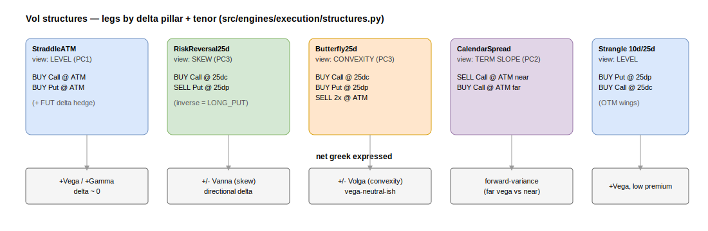

# Vol structures

The desk trades EUR/USD volatility through a fixed catalogue of option
structures. Each is a small frozen dataclass in
[`src/engines/execution/structures.py`](../../src/engines/execution/structures.py)
that exposes three pure methods:

- `legs(forward, surface)` — the list of `Leg` tuples the operator sees on the ticket.
- `net_greeks(forward, surface)` — total vega / gamma / theta / delta, priced off
  the current surface with the Black-76 helpers `bs_price` / `bs_greeks`.
- (via `_sum_greeks`) signed aggregation, `+1` for `BUY`, `-1` for `SELL`.

Pricing is I/O-free: no IB calls, no interest rate, futures-underlying Black-76.
A separate adapter turns `legs()` into IB orders at submit time (see
[order-lifecycle.md](../execution/order-lifecycle.md)).



## How a leg is addressed: delta pillar × tenor

Legs are never quoted by raw strike inside a structure. They reference a
**delta pillar label** on a **tenor** and read `(iv, strike)` back from the
surface dict via `_pillar_iv_strike(surface, tenor, label)`:

| Label | Meaning |
|---|---|
| `atm` | at-the-money (50Δ) |
| `25dc` / `25dp` | 25-delta call / put wing |
| (`10dc`/`10dp`) | 10-delta wings, exposed by the builder |

Tenors resolve to year-fractions through `TENOR_YEARS` (`1M`…`6M`). This keeps
the structure independent of the live market: the frontend sends structure +
pillar, the backend re-prices strikes from the live surface (`build_from_legs`),
so client strikes are never trusted — except a hand-typed vanilla strike.

## The catalogue

### StraddleATM — level
`BUY Call @ atm` + `BUY Put @ atm` on one tenor. Delta ≈ 0 by construction
(`delta = 0.0`), so it is near-pure **+vega / +gamma**: a bet on the *level* of
implied vol. An optional `FUT` leg neutralises any residual delta.

### Strangle — level, cheaper
`BUY Put @ 25dp` + `BUY Call @ 25dc` (OTM wings, no ATM body). Same directional
view as the straddle at lower premium, more vanna. Built in the frontend
(`orderLegs.ts`); the backend classifies it from the two-wing leg shape.

### RiskReversal25d — skew
`BUY Call @ 25dc` + `SELL Put @ 25dp` (or the inverse via `direction="LONG_PUT"`).
The two legs sit on different-delta strikes with different IVs, so the trade
variable is exactly `IV_put − IV_call` — the **smile skew**. The order builder
surfaces that spread live as the "Skew p−c" read.

### Butterfly25d — convexity
`BUY 25dc` + `BUY 25dp` − `2× ATM` (the ATM body is the opposite side of the
wings). Long the wings, short the body → long **smile convexity / volga**, roughly
vega-neutral. `side="BUY"` = long convexity.

### CalendarSpread — term slope
`SELL Call @ atm` on `tenor_near`, `BUY Call @ atm` on `tenor_far`. Trades
**forward variance**: long the far tenor's vega against the near. `side="BUY"`
= long the far / short the near (positive forward-var view).

## Mapping a signal to a structure

`signal_to_structure(pc_label, tenor, direction)` is the canonical map from a
PCA factor to its trade (see [signals-to-trades.md](signals-to-trades.md)):

```python
level      -> StraddleATM
term_slope -> CalendarSpread(tenor_near="1M", tenor_far=tenor)
smile      -> Butterfly25d
skew       -> RiskReversal25d
```

`direction="EXPENSIVE"` flips `side` to `SELL` (short the structure); the default
`"CHEAP"` buys it. The mapping's canonical structure per PC is also configurable
in [`core/config/vol_params.py`](../../src/core/config/vol_params.py)
(`TradeStructuresConfig`).

## Frontend order builder

[`OrderBuilder.tsx`](../../frontend/src/voldesk/components/OrderBuilder.tsx) drives
input by product through the `STRUCT` metadata table (`mode`, greek read `order`,
`naked` tail-risk flag, `skew` flag). It previews the structure's net greeks
client-side (`previewGreeks`), then a write-gated `POST /trade/preview` returns the
server-priced, validated ticket.
[`orderLegs.ts`](../../frontend/src/voldesk/components/orderLegs.ts) (`builderToLegs`)
converts the product selection into backend free legs (`PreviewLeg`, structure +
`delta_pillar` only). Butterfly/strangle/RR force 25Δ wings when ATM is picked so
the legs never collapse onto one strike.
