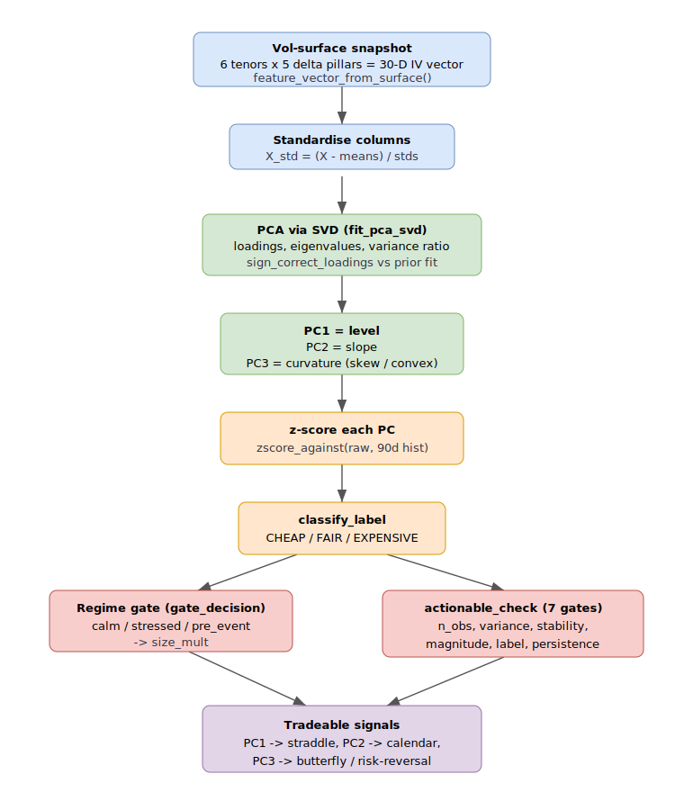

# PCA signals — the level / slope / curvature factor model

This is the signal core of the desk. Each vol-engine cycle turns the current
implied-vol surface into three orthogonal factors, standardises them against
their own recent history, gates them by regime, and emits at most three
tradeable signals. All the maths is pure `numpy` in
[`src/core/vol/pca_engine.py`](../../src/core/vol/pca_engine.py) — the engine
([`src/engines/vol/engine.py`](../../src/engines/vol/engine.py),
`_compute_pca_signals`) only supplies history from Postgres and persists the
output.

> Runnable deep-dive: [`notebooks/pca_signal_pipeline_explained.ipynb`](notebooks/pca_signal_pipeline_explained.ipynb)
> walks the whole pipeline on real snapshots, step by step.



## 1. The 30-D observation

The surface snapshot is a fixed **6 tenors × 5 delta pillars = 30-D** vector,
built by `feature_vector_from_surface`:

```python
TENORS = ("1M", "2M", "3M", "4M", "5M", "6M")
DELTAS = ("10dp", "25dp", "atm", "25dc", "10dc")
N_FEATURES = len(TENORS) * len(DELTAS)  # 30
```

The layout is tenor-outer / delta-inner (`x[i*5 + j]`), IV expressed in percent.
Any missing cell returns `None` and the cycle is skipped — PCA needs a complete
grid. The pillars match `core.vol.tenors.DISPLAY_PILLARS`, so the vector aligns
with the [display surface](volatility-surface.md).

## 2. Fitting the factor model (SVD, not sklearn)

`fit_pca_svd(X, n_components=6)` fits PCA on a standardised `(T, 30)` matrix via
`numpy.linalg.svd` — deterministic, and keeps `sklearn` out of the vol-engine
image. Columns are z-standardised first (`ddof=1`, constant columns guarded),
then truncated SVD gives loadings, eigenvalues and the variance ratio:

```python
X_std = (X - means) / stds
_, S, Vt = np.linalg.svd(X_std, full_matrices=False)
loadings    = Vt[:n_components]
eigenvalues = (S[:n_components] ** 2) / (T - 1)
var_ratio   = eigenvalues / total_var
```

The three leading PCs carry the classic term-structure interpretation:

| PC | Interpretation | Min variance gate |
|----|----------------|-------------------|
| PC1 | **level** — whole surface up/down | `0.60` |
| PC2 | **slope** — term structure steepen/flatten | `0.15` |
| PC3 | **curvature** — smile skew / convexity | `0.05` |

`MIN_VARIANCE_EXPLAINED = {1: 0.60, 2: 0.15, 3: 0.05}` encodes those floors.
Because eigenvectors have arbitrary sign, `sign_correct_loadings` flips each new
PC to maximise cosine similarity against the previous fit, so PC1 stays "level up"
across re-fits. The engine reads the stored per-PC `cosine_similarity_pcN` and
treats `>= 0.85` as loadings-stable.

## 3. Projection and z-scoring

The live 30-D vector is projected on the stored loadings to get one raw score
per PC, then standardised against that PC's own rolling history of raw scores:

```python
def project(x, means, stds, loadings):
    x_std = (x - means) / stds
    return loadings @ x_std           # raw score per PC

def zscore_against(value, hist):      # needs >= 5 finite obs
    return (value - mean(hist)) / std(hist, ddof=1)
```

The engine pulls the last 90 days of `PcaSignal` rows per PC for both the raw-score
history (z-score denominator) and the z-score history (persistence check). The
z-score is the tradeable quantity — it says *how far the surface sits from its own
recent distribution*, not its absolute level.

## 4. Labelling and strength

`classify_label(z, threshold=1.5)` maps the z to a rich/cheap verdict, sign
convention `z > 0` = surface above expectation = **EXPENSIVE**:

```python
if abs(z) < threshold: return "FAIR"
return "EXPENSIVE" if z > 0 else "CHEAP"
```

`classify_strength` buckets `|z|` against
`THRESHOLDS = {weak: 1.0, moderate: 1.5, strong: 2.0, extreme: 3.0}`.

**PC3 sub-signals.** Curvature is further decomposed by `pc3_sub_metrics(x)` into
two smile-shape numbers, each averaged over the six tenors:

- `skew   = mean(iv_25dc − iv_25dp)` — the risk-reversal slope
- `convex = mean(iv_10dp + iv_10dc − 2·iv_atm)` — the butterfly width

These are linear in `x` but not collinear with the PC3 loading, so they describe
the smile independently. The engine z-scores each against a 200-row snapshot
history (`skew_z`, `convex_z`).

## 5. Actionability — seven hard gates

`actionable_check` is the gate between a *number* and a *tradeable signal*. A PC
is actionable only if it clears all seven gates (5 original + 2 post-MVP):

1. `n_obs >= MIN_N_OBS_HARD` (30) — enough fit history
2. `cumulative_variance >= MIN_CUMULATIVE_VARIANCE` (0.85) — PC1+2+3 above the noise floor
3. `loadings_stable` — cosine sim vs the prior fit `>= 0.85`
4. `variance_explained >= MIN_VARIANCE_EXPLAINED[pc]`
5. `|z| >= THRESHOLDS["weak"]` (1.0) — above the magnitude threshold
6. `label != "FAIR"`
7. `persistent` — see below

The first failing gate sets `actionable=False` and a machine-readable `reason`
(`low_n_obs`, `low_variance_pc2`, `signal_not_persistent`, …), which
`reason_category` maps to a UI colour bucket.

**Persistence** (`is_persistent`) requires the last `n_cycles=3` z-scores to all
exceed the weak threshold **and share the same sign** — a one-cycle spike never
trades.

**Coherence** (`check_coherence`) flags a PC1/PC2 direction contradiction (one
CHEAP, the other EXPENSIVE) as informational only; it never blocks.

## 6. Regime gating

Actionability answers "is this signal real?"; the [regime gate](regime.md)
answers "are we allowed to trade it, and how big?". `gate_decision` returns a
`size_mult` in `{0.0, 0.5, 0.7, 1.0}` — `pre_event` and unstable regimes force
`0.0`, `stressed` sizes to `0.7`, an active event dampener to `0.5`, `calm` to
full `1.0`. The two gates are independent and both must pass.

## 7. From factor to structure

The label + strength of each actionable PC map onto a structure (see
[strategy/signals-to-trades](../strategy/signals-to-trades.md)):

- **PC1 (level)** → straddle / strangle
- **PC2 (slope)** → calendar spread
- **PC3 (curvature)** → butterfly (convexity) or risk-reversal (skew)

## Output payload

Per cycle the engine writes `_pca_signals` onto the surface and one
`pca_signal_history` row per PC, carrying `raw_score`, `z_score`, `label`,
`actionable`, `actionable_reason`, plus `sub_signals` for PC3, and a top-level
`variance_explained` / `loadings_stable` / `coherence` diagnostics block. When no
active `PcaModel` exists the payload is a `bootstrap` state and nothing trades.

## See also

- [Volatility surface](volatility-surface.md) — where the 30-D input comes from
- [Regime detection](regime.md) — the gate on top of every signal
- [Forecasting](forecasting.md) — realized-vol / VRP fair-value context
