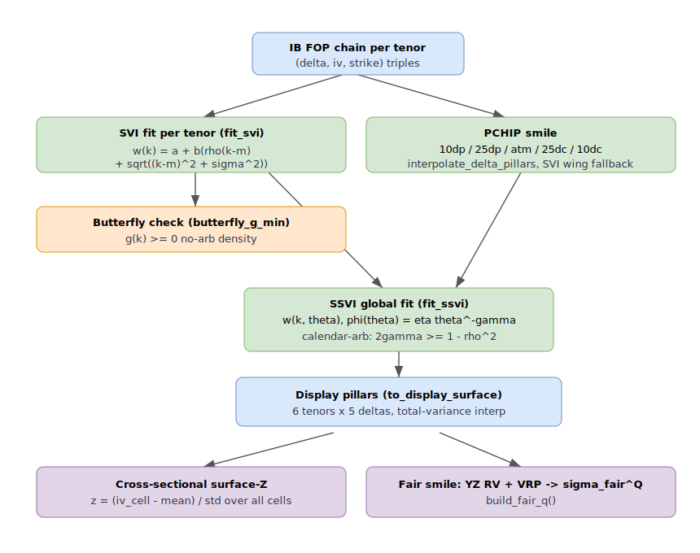

# Volatility surface — SVI per tenor, SSVI global, fair smile

The vol-engine rebuilds the EUR/USD implied-vol surface every cycle from the IB
FOP option chain. This doc covers how raw `(delta, iv, strike)` observations
become a clean, no-arbitrage, display-ready surface: PCHIP smile interpolation,
raw-SVI per tenor, SSVI as a global sanity fit, the delta/tenor pillar grid, the
cross-sectional surface-Z, and the RV-anchored fair smile.

The orchestration lives in [`src/engines/vol/engine.py`](../../src/engines/vol/engine.py)
(`_compute_surface`); the maths is pure and unit-tested under `src/core/vol/`.



## 1. Delta / tenor pillars

The desk works on a fixed grid of six display tenors and five delta pillars
(`core.vol.tenors`, `core.vol.pchip_smile`):

```python
DISPLAY_PILLARS = ("1M", "2M", "3M", "4M", "5M", "6M")   # target DTE 30..180
DELTA_PILLARS   = ("10dp", "25dp", "atm", "25dc", "10dc")
```

CME lists options only at discrete expiries, so each display pillar is tagged
`listed` (a real expiry within `LISTED_TOLERANCE_DAYS=12` of the target),
`interp` (bracketed by two listed expiries), or `missing` (beyond the furthest
listed expiry — never freely extrapolated). `to_display_surface` re-keys the raw
listed-tenor surface onto the six pillars; term interpolation is **linear in
total variance** `w = σ²·t`, the arbitrage-reasonable convention:

```python
w_lo = iv_lo**2 * dte_lo
w = w_lo + (w_hi - w_lo) * (target - dte_lo) / (dte_hi - dte_lo)
iv = sqrt(w / target)
```

## 2. Smile interpolation — PCHIP keyed by delta

`interpolate_delta_pillars` fits two monotone `PchipInterpolator` splines per
tenor — `iv vs delta` and `strike vs delta` — and samples them at the canonical
pillars (`atm=0.50`, `25dc=0.25`, `25dp=0.75`, `10dc=0.10`, `10dp=0.90`; call
delta `d`, put `1−d`). PCHIP does **not** extrapolate: a pillar outside the
observed delta support returns `None` unless a `fallback` (a calibrated SVI, see
below) is supplied *and* the target sits within `max_extrapolation_distance=0.10`
delta of the observed boundary. Each pillar records its `source`
(`pchip` / `svi_fallback` / `none`).

## 3. Raw SVI per tenor

Each tenor's smile is fit independently with the raw SVI (Gatheral 2004)
parametrisation of total variance in log-moneyness `k = ln(K/F)`
([`core/vol/svi.py`](../../src/core/vol/svi.py)):

```
w(k) = a + b · ( ρ·(k − m) + sqrt((k − m)² + σ²) )
```

Five parameters: `a` level, `b` wing slope, `ρ` skew (`[-1,1]`), `m` ATM shift,
`σ` ATM curvature. `fit_svi` runs `scipy.optimize.least_squares` (TRF, bounded)
against observed total variance `w_obs = iv²·T`, seeded at
`x0 = [min(w_obs)·0.9, 0.04, -0.2, 0.0, 0.1]` (a mild put skew) with bounds
`b >= 0`, `|ρ| < 1`, `σ > 0`. Fewer than 3 points or a non-converged optimiser
returns `None`, and the caller falls back to the raw observed smile.

The SVI fit does double duty: it is the wing **fallback** for PCHIP
(`_build_svi_fallback` inverts `δ = Φ(d1)` by fixed-point iteration to turn a
target delta into a strike), and it is stored as the `_svi` payload for
downstream consumers.

### Butterfly no-arbitrage check

`butterfly_g_min` evaluates Gatheral's density function on a `k` grid:

```
g(k) = (1 − k·w'/(2w))²  −  (w'²/4)·(1/w + 1/4)  +  w''/2
```

`g(k) >= 0` everywhere ⟺ no butterfly arbitrage (no negative risk-neutral
density). The helper returns `min g` over the grid; a negative value logs
`svi_butterfly_violation` and **disables the wing fallback** for that tenor
(`_build_svi_fallback` returns `None` when `butterfly_g_min < 0`) — propagating
an arb-violating fit into the wings would be worse than leaving them empty.

## 4. SSVI — the global surface fit

SSVI (Gatheral–Jacquier 2014, [`core/vol/ssvi.py`](../../src/core/vol/ssvi.py))
describes the **entire** surface with three parameters instead of five per tenor.
With ATM total variance `θ = σ²_ATM·T`:

```
w(k, θ) = (θ/2) · ( 1 + ρ·φ(θ)·k + sqrt((φ(θ)·k + ρ)² + (1 − ρ²)) )
φ(θ)    = η · θ^(−γ)
```

`fit_ssvi` jointly fits `(η, γ, ρ)` across all `(T, K, iv)` observations
(bounds `η∈[1e-3,10]`, `γ∈[0.05,0.95]`, `|ρ|<1`), needing ≥ 2 tenors and ≥ 5
points. SSVI is **calendar-arb-free by construction** when `2γ >= 1 − ρ²` and
`η > 0`; the fit checks that inequality and logs `ssvi_calendar_arb_weak`
otherwise, returning `calendar_arb_free` alongside `rmse_fit`. SSVI is used as a
surface-level smoother / sanity reference — the per-tenor SVI already owns the
butterfly check.

## 5. Cross-sectional surface-Z

`cross_sectional_z` ([`core/vol/surface_z.py`](../../src/core/vol/surface_z.py))
standardises every `(tenor, delta)` cell against the **whole current surface**:

```
z = (iv_cell − mean(all cells)) / std(all cells)
```

This is a **shape map**, not a temporal signal — it needs no history so the
heatmap colours on the first cycle. Wings read positive, ATM negative, and the
`10dp` vs `10dc` gap shows put/call skew. It visualises the (structurally stable)
smile + term shape rather than rich/cheap-vs-fair. Empty on `< min_cells=6` valid
cells or a flat surface.

## 6. Fair smile — RV anchored

The [fair-vol term structure](forecasting.md) (`core.vol.fair_term.build_fair_q`)
attaches a Q-measure fair vol per tenor, `σ_fair^Q = σ_fair^P + VRP(tenor,
regime)`. `σ_fair^P` is **anchored to the Yang-Zhang realised vol** — horizon-
matched per tenor when present, else the full-sample RV — with HAR-RV / GARCH
kept only as forward-looking diagnostics and last-resort fallbacks. This gives a
fair *smile* the desk compares the live IV surface against; the difference drives
the [rich/cheap PCA signals](pca-signals.md).

## Surface build order

`_compute_surface` runs the pipeline in a specific order so each stage sees what
it needs:

1. Fetch FOP chain → raw `(delta, iv, strike)` per tenor
2. Pre-fit SVI per tenor (also the PCHIP wing fallback) — off-loop via `asyncio.to_thread`
3. PCHIP-interpolate the five delta pillars per tenor
4. Store `_svi`; fit `_ssvi` across the raw listed tenors (they still hold real strikes)
5. `to_display_surface` → re-key to the six display pillars
6. Attach fair vol (`_rv_full_pct`, `_har`, `_garch`, `_fair_q`)
7. Attach per-cell cross-sectional `z`

## See also

- [PCA signals](pca-signals.md) — the 30-D surface vector feeds the factor model
- [Forecasting](forecasting.md) — Yang-Zhang / HAR / GARCH / VRP behind the fair smile
- [Regime detection](regime.md) — sets the VRP bucket used by the fair smile
